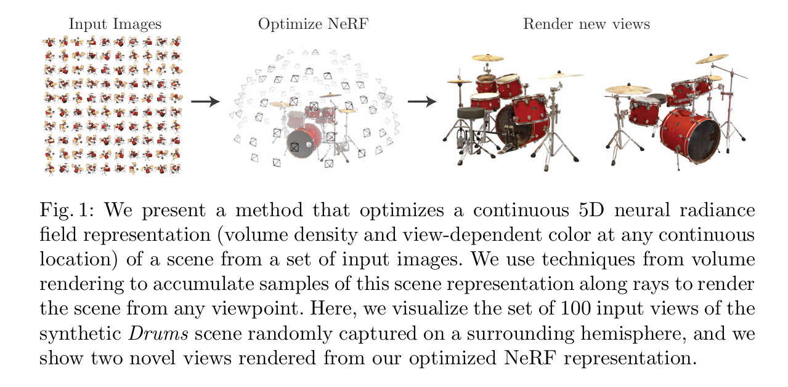
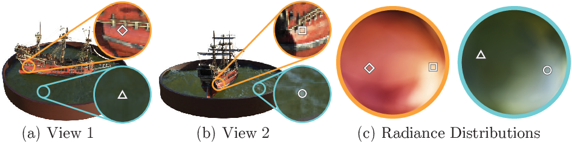
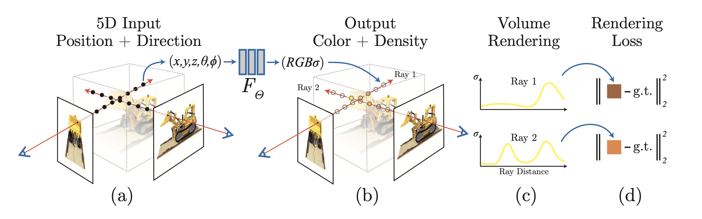
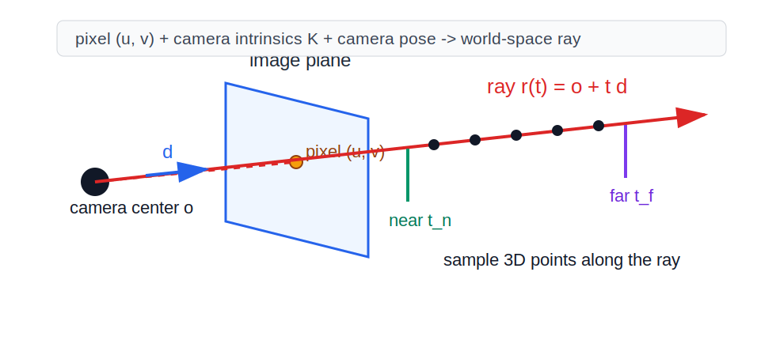

# NeRF Reading Notes

Paper: [NeRF: Representing Scenes as Neural Radiance Fields for View Synthesis](https://arxiv.org/pdf/2003.08934)  
Project page: [matthewtancik.com/nerf](https://www.matthewtancik.com/nerf)
Video explanation: https://www.youtube.com/watch?v=WSfEfZ0ilw4

Context: the original NeRF work comes mainly from the Berkeley graphics / vision ecosystem, with connections to Google Research and UCSD. Names worth recognizing when building the map: Ben Mildenhall, Pratul Srinivasan, Matthew Tancik, Jonathan Barron, Ravi Ramamoorthi, and Ren Ng. For the broader lineage, keep Berkeley, Google Research, NVIDIA Research, and the later 3D Gaussian Splatting groups in mind.

## 0. The Goal

Given multiple posed images of a static scene,

$$
\{I_i, \Pi_i\}_{i=1}^N,
$$

NeRF learns a continuous 3D scene function that can be rendered from novel camera poses.



This pipeline figure is the high-level story of the paper:

```text
input posed images
-> optimize a continuous 5D neural radiance field
-> render novel views from new camera poses
```

The important shift is this:

```text
not: image -> image
but: images + camera poses -> continuous 3D radiance field -> rendered images
```

A NeRF model is optimized per scene. It is not, in the original paper, a general feed-forward model that reconstructs arbitrary scenes in one pass.

```text
Original NeRF:
    collect images of one scene
    estimate/know camera poses
    train one MLP for that scene
    the trained network overfits / stores that specific scene

New scene:
    collect a new multi-view image set
    train a new NeRF again
```

So the trained MLP is closer to a compressed scene representation than a general model that understands all scenes.

## 1. Neural Radiance Field as a 5D Function

Before the formula, it helps to unpack the phrase itself.

**Field** means a function defined over space. For example:

- A temperature field maps every 3D location to a temperature.
- A velocity field maps every 3D location to a motion vector.
- A density field maps every 3D location to how much matter exists there.

So a **neural field** is simply a field represented by a neural network. In the original NeRF, this neural network is <span style="color:red">an MLP that maps continuous coordinates to density and color</span>, instead of storing the scene as an explicit grid or mesh.

**Radiance** means the amount of light traveling from a point in a particular direction. In NeRF, the color is direction-dependent because the same 3D point can look different from different viewing directions due to highlights, reflections, or other view-dependent effects.

The paper's Figure 3 is the best visual intuition for this. It fixes two 3D points in the scene: one on the ship and one on the water. Then it shows that the RGB value predicted at the same 3D point changes as the viewing direction changes.



The key idea from that figure:

```text
same 3D position x
+ different viewing direction d
-> different emitted radiance / RGB color
```

The colored spheres in the figure visualize the directional color distribution for a fixed spatial point. A point on the water is especially view-dependent because specular reflection changes strongly with camera direction. This is why NeRF predicts color as $\mathbf{c}(\mathbf{x}, \mathbf{d})$, not just $\mathbf{c}(\mathbf{x})$.

Therefore, a **Neural Radiance Field** is:

```text
a neural network that answers:
at 3D position x, viewed from direction d,
what color should be seen, and how much matter is there?
```

<span style="color:red">This is why NeRF is not just a color field. It predicts both appearance and density.</span>

NeRF represents the scene as a function:

$$
F_\Theta: (\mathbf{x}, \mathbf{d}) \rightarrow (\mathbf{c}, \sigma)
$$

where:

- $\mathbf{x}=(x,y,z)$ is a 3D position.
- $\mathbf{d}$ is the viewing direction.
- $\mathbf{c}=(r,g,b)$ is the emitted / observed color from that point along that direction.
- $\sigma$ is volume density.



This figure connects the whole mechanism: sample 5D coordinates along camera rays, query the MLP for color and density, composite the samples with volume rendering, and minimize the rendering loss against ground-truth pixels.

In code-like form:

```python
def nerf_mlp(x, d):
    color, density = mlp_theta(x, d)
    return color, density
```

The key design is:

$$
\sigma = \sigma(\mathbf{x})
$$

$$
\mathbf{c} = \mathbf{c}(\mathbf{x}, \mathbf{d})
$$

<span style="color:red">Geometry should not depend on the viewing direction, so density only depends on position.</span> 
Appearance may depend on viewing direction, because real scenes contain view-dependent effects such as specular highlights.

This is one of the main reasons NeRF can model non-Lambertian appearance better than methods that assume the same color from all directions.

```python
non-Lambertian appearance:
    same 3D point + different viewing direction -> different observed color
```

## 2. From Pixel to Ray

Each pixel corresponds to a camera ray:

$$
\mathbf{r}(t)=\mathbf{o}+t\mathbf{d}
$$



where:

- $\mathbf{o}$ is the camera center.
- $\mathbf{d}$ is the ray direction.
- $t$ is distance along the ray.
- $t_n,t_f$ are near and far bounds.

Given camera intrinsics $K$, a pixel $(u,v)$ can be converted to a camera-space direction:

Here $(u,v)$ is the 2D pixel coordinate on the image plane:

```text
u = horizontal image coordinate
v = vertical image coordinate
[u, v, 1]^T = homogeneous pixel coordinate
```

$$
\mathbf{d}_{cam}
=K^{-1}
\begin{bmatrix}
u\\
v\\
1
\end{bmatrix}
$$

Then the camera-to-world rotation maps it into world space:

$$
\mathbf{d}_{world}=R_{wc}\mathbf{d}_{cam}
$$

and the ray origin is the camera center:

$$
\mathbf{o}_{world}=\mathbf{t}_{wc}
$$

So NeRF training samples are not ordinary image patches. They are camera rays with target RGB values.

## 3. Sampling Points Along a Ray

Important distinction:

```text
Dataset collection:
    RGB images from different camera views
    known or estimated camera intrinsics and poses

Training computation:
    choose pixels/rays from those images
    sample candidate depths along each selected ray
```

NeRF does **not** observe depth images in the original paper. RGB gives the target color of a pixel, but it does not directly tell us where along the ray that color came from.

So NeRF samples candidate depths:

```text
RGB has no depth label.
Therefore, along a selected ray, try many possible depths between near and far.
The MLP learns which depths should have high density by minimizing RGB rendering loss across many views.
```

One selected pixel gives one camera ray. Sampling along that ray means sampling different possible depths for that pixel:

```text
pixel (u, v)
-> one viewing ray
-> candidate depth t_1, t_2, ..., t_N
-> 3D query points x_i = o + t_i d
```

For each ray, sample points between near and far:

$$
t_1,t_2,\dots,t_N \in [t_n,t_f]
$$

$$
\mathbf{x}_i = \mathbf{o}+t_i\mathbf{d}
$$

The paper uses stratified sampling: divide the interval into $N$ bins and sample one point randomly inside each bin:

$$
t_i \sim \mathcal{U}
\left[
t_n+\frac{i-1}{N}(t_f-t_n),
t_n+\frac{i}{N}(t_f-t_n)
\right]
$$

Why this matters:

- Fixed samples would query the network at the same discrete locations every time.
- Random jitter inside bins exposes the model to a continuous range of positions over training.
- The rendered image is still computed from discrete samples, but the learned field is continuous.

The sampled points are only hypotheses. At the beginning, NeRF does not know which depth is correct. During training, density becomes high near depths that consistently explain many camera views, and low in empty space.

```text
single RGB pixel:
    depth is ambiguous

many RGB views + known camera poses + shared 3D field:
    density/depth can be inferred indirectly
```

```python
def stratified_sample(near, far, n_samples):
    bins = linspace(near, far, n_samples + 1)
    t_vals = []
    for i in range(n_samples):
        t_vals.append(uniform(bins[i], bins[i + 1]))
    return t_vals

def points_on_ray(ray_origin, ray_direction, t_vals):
    return [ray_origin + t * ray_direction for t in t_vals]
```

## 4. Volume Rendering

Volume rendering is the bridge between the 3D field and 2D pixel supervision.

The continuous rendering equation used by NeRF is:

$$
C(\mathbf{r})=
\int_{t_n}^{t_f}
T(t)\sigma(\mathbf{r}(t))\mathbf{c}(\mathbf{r}(t),\mathbf{d})dt
$$

where transmittance is:

$$
T(t)=
\exp\left(
-\int_{t_n}^{t}\sigma(\mathbf{r}(s))ds
\right)
$$

Interpretation:

- $T(t)$ is the probability that the ray travels from $t_n$ to $t$ without being blocked.
- $\sigma(\mathbf{r}(t))dt$ is the probability mass that the ray terminates near $t$.
- $\mathbf{c}(\mathbf{r}(t),\mathbf{d})$ is the color observed if the ray terminates there.

So the integrand means:

```text
probability of reaching t
* probability of terminating at t
* color seen at t
```

In practice, NeRF uses a discrete approximation:

$$
\hat{C}(\mathbf{r})=
\sum_{i=1}^{N}T_i\alpha_i\mathbf{c}_i
$$

with:

$$
\alpha_i=1-\exp(-\sigma_i\delta_i)
$$

$$
T_i=\exp\left(-\sum_{j=1}^{i-1}\sigma_j\delta_j\right)
$$

$$
\delta_i=t_{i+1}-t_i
$$

Define the weight:

$$
w_i=T_i\alpha_i
$$

Then:

$$
\hat{C}(\mathbf{r})=\sum_i w_i\mathbf{c}_i
$$

Mental model:

- $\alpha_i$ says how opaque the current interval is.
- $T_i$ says how much visibility remains after previous intervals.
- $w_i$ says how much this sample contributes to the final pixel.

```python
def volume_render(colors, densities, t_vals):
    rgb = 0
    transmittance = 1

    for i in range(len(t_vals) - 1):
        delta = t_vals[i + 1] - t_vals[i]
        alpha = 1 - exp(-densities[i] * delta)
        weight = transmittance * alpha

        rgb += weight * colors[i]
        transmittance *= exp(-densities[i] * delta)

    return rgb
```

This formula is the heart of NeRF. It contains geometry, visibility, occlusion, and color in one differentiable computation.

## 5. Rendering Loss

This section is what the paper calls **optimizing a neural radiance field**.

The key idea: NeRF does not have ground-truth 3D supervision. It does not know the true mesh, depth map, density field, or surface positions. The only supervision is:

```text
when I render this camera ray, the predicted RGB should match the real pixel RGB
```

So the optimization target is not directly geometry. The target is image reconstruction, and geometry emerges because the same field must explain many views.

The basic loss compares rendered colors against observed pixel colors:

$$
\mathcal{L}=
\sum_{\mathbf{r}\in\mathcal{R}}
\left\|
\hat{C}(\mathbf{r})-C_{gt}(\mathbf{r})
\right\|_2^2
$$

The actual NeRF system uses both coarse and fine predictions:

$$
\mathcal{L}=
\sum_{\mathbf{r}\in\mathcal{R}}
\left[
\left\|
\hat{C}_c(\mathbf{r})-C(\mathbf{r})
\right\|_2^2
+
\left\|
\hat{C}_f(\mathbf{r})-C(\mathbf{r})
\right\|_2^2
\right]
$$

The coarse network must also be supervised because the fine network samples according to the coarse network's estimated importance distribution.

What is being optimized?

The trainable object is the MLP parameter set $\Theta$:

$$
\Theta^{*}=\operatorname*{arg\,min}_{\Theta}
\sum_{\mathbf{r}\in\mathcal{R}}
\left\|
\hat{C}_\Theta(\mathbf{r})-C_{gt}(\mathbf{r})
\right\|_2^2
$$

For one training ray, the computation graph is:

```text
camera pose + pixel
-> ray r(t)
-> sampled 3D points x_i
-> MLP predicts c_i and sigma_i
-> volume rendering combines them into predicted pixel color
-> compare with real pixel color
-> backpropagate through rendering into the MLP
```

So gradients flow backward through:

```text
RGB loss
-> rendered color
-> weights w_i = T_i alpha_i
-> density sigma_i and color c_i
-> MLP parameters Theta
```

This is the subtle but important part: the model is not told where the surface is. If the rendered pixel is too dark, too bright, or the wrong color, gradient descent can adjust:

- the predicted color $\mathbf{c}_i$ at sampled points,
- the density $\sigma_i$, which changes where the ray appears to terminate,
- and therefore the visibility weights $w_i$ along the ray.

For example, suppose a ray should see a red surface at depth $t=3$, but the current model puts high density at $t=2$ with a gray color. The rendered pixel will be wrong. Backpropagation can reduce density at the wrong location, increase density near the correct surface, and adjust the color there toward red. Across many camera views, only geometrically consistent density placements keep reducing loss.

That is what “optimizing a neural radiance field” means:

```text
optimize the neural network parameters so that,
after ray sampling and volume rendering,
all training pixels are reconstructed correctly.
```

## 6. Why Multi-View RGB Supervision Creates 3D Structure

A single image cannot determine 3D geometry uniquely. The depth ambiguity is too large.

NeRF works because all views share the same field:

$$
\text{same } F_\Theta \text{ explains all training views}
$$

If density is placed at the wrong depth, it may explain one view, but it will usually fail to explain other views whose rays pass through the scene differently. Optimization therefore pushes high density toward locations that are consistent across many views.

A useful intuition:

```text
empty space -> low density
real surfaces -> high density
occluded regions -> low contribution because transmittance is already small
```

This requires reasonably good camera poses, sufficient view coverage, static scenes, and sensible near/far bounds. In real captures, the camera poses are often estimated with SfM tools such as COLMAP.

## 7. Positional Encoding

A plain MLP tends to learn low-frequency functions first. This is often called spectral bias. If the raw input is just $(x,y,z,d_x,d_y,d_z)$, the model tends to produce blurry geometry and texture.

NeRF applies Fourier feature positional encoding:

$$
\gamma(p)=
\left(
\sin(2^0\pi p),\cos(2^0\pi p),
\dots,
\sin(2^{L-1}\pi p),\cos(2^{L-1}\pi p)
\right)
$$

This is applied independently to each coordinate.

The paper uses:

- $L=10$ for position $\mathbf{x}$.
- $L=4$ for direction $\mathbf{d}$.

```python
def positional_encoding(p, L):
    features = []
    for k in range(L):
        features.append(sin((2 ** k) * pi * p))
        features.append(cos((2 ** k) * pi * p))
    return concat(features)
```

The point is not just to mark position. It maps coordinates into a space where the MLP can more easily represent high-frequency spatial variation: sharp boundaries, thin structures, and fine texture.

It resembles Transformer positional encoding in form, but the role is different:

- Transformer: inject token order.
- NeRF: make high-frequency continuous functions easier to learn.

## 8. Hierarchical Sampling

Uniformly sampling many points on every ray wastes computation. Most samples are in empty space or behind already-opaque regions.

NeRF uses coarse-to-fine sampling:

1. The coarse network samples $N_c$ points along a ray.
2. Volume rendering gives weights $w_i$ for those points.
3. The weights are normalized into a PDF.
4. Extra fine samples are drawn from this distribution.
5. The fine network renders using both coarse and fine samples.

The weight used for importance sampling is:

$$
w_i=T_i(1-\exp(-\sigma_i\delta_i))
$$

The normalized distribution is:

$$
\hat{w}_i=\frac{w_i}{\sum_j w_j}
$$

Pseudo-code:

```python
coarse_t = stratified_sample(near, far, Nc)
coarse_points = points_on_ray(ray.o, ray.d, coarse_t)
coarse_colors, coarse_sigmas = coarse_nerf(coarse_points, ray.d)
coarse_rgb, weights = volume_render_with_weights(coarse_colors, coarse_sigmas, coarse_t)

fine_t_extra = sample_pdf(coarse_t, weights, Nf)
fine_t = sort(concat(coarse_t, fine_t_extra))
fine_points = points_on_ray(ray.o, ray.d, fine_t)
fine_colors, fine_sigmas = fine_nerf(fine_points, ray.d)
fine_rgb = volume_render(fine_colors, fine_sigmas, fine_t)
```

This is basically importance sampling over the ray: spend more samples where the coarse model believes the ray color is actually being formed.

## 9. Network Architecture

The original architecture is roughly:

```text
encoded position γ(x)
-> 8-layer MLP, 256 hidden units, ReLU
-> density σ + feature vector

feature vector + encoded direction γ(d)
-> color head
-> RGB
```

The architectural bias is important:

- The geometry trunk predicts density from position.
- The color head predicts view-dependent RGB using both position-derived features and direction.

This separation encourages stable geometry while still allowing specular or direction-dependent appearance.

## 10. Density Is Not SDF

NeRF density $\sigma$ should not be confused with a signed distance field.

| Concept | Meaning |
| --- | --- |
| SDF | Signed distance to a surface; the surface is $f(x)=0$ |
| Occupancy | Whether a point is inside or near an object |
| NeRF density | Probability intensity that a ray terminates near this point |

NeRF learns volumetric geometry. A mesh can be extracted afterward with thresholding and marching cubes, but a clean mesh is not the native representation.

## 11. Implicit Representation

Explicit representations store geometry directly:

```python
mesh = vertices + faces
point_cloud = points
voxel = 3d_grid
```

NeRF stores a function:

```python
scene = mlp_theta
```

Mathematically:

$$
\text{Scene}=F_\Theta(\mathbf{x},\mathbf{d})
$$

| Representation | Stores | Strength | Weakness |
| --- | --- | --- | --- |
| Mesh | Vertices and faces | Fast rendering, editable | Hard topology optimization, weak for complex view effects |
| Voxel | 3D grid | Natural for volumes | Memory grows cubically with resolution |
| Point cloud | Points | Easy from SfM / LiDAR | Weak continuous surfaces and occlusion handling |
| NeRF | Continuous function | Compact, high quality, continuous | Slow training/rendering, hard to edit |

## 12. Training Loop

A simplified training loop:

```python
for step in range(num_steps):
    rays, gt_colors = sample_random_rays(images, poses, intrinsics)

    coarse_rgb, weights = render_with_coarse_nerf(rays)
    fine_rgb = render_with_fine_nerf(rays, weights)

    loss = mse(coarse_rgb, gt_colors) + mse(fine_rgb, gt_colors)

    optimizer.zero_grad()
    loss.backward()
    optimizer.step()
```

Original paper details worth remembering:

- One NeRF is optimized per scene.
- The trained network is intentionally overfit to that scene; this is the representation.
- Batch size is 4096 rays.
- Coarse samples: $N_c=64$.
- Additional fine samples: $N_f=128$.
- Optimizer: Adam.
- Learning rate decays from $5\times10^{-4}$ to $5\times10^{-5}$.
- Training one scene was slow in the original setup, often on the order of many hours to days.

## 13. Core Formula Set

Field:

$$
F_\Theta(\mathbf{x},\mathbf{d})\rightarrow(\mathbf{c},\sigma)
$$

Ray:

$$
\mathbf{r}(t)=\mathbf{o}+t\mathbf{d}
$$

Rendering:

$$
\hat{C}(\mathbf{r})=
\sum_i
\exp\left(-\sum_{j<i}\sigma_j\delta_j\right)
\left(1-e^{-\sigma_i\delta_i}\right)
\mathbf{c}_i
$$

Loss:

$$
\mathcal{L}=
\sum_{\mathbf{r}}
\left\|
\hat{C}(\mathbf{r})-C_{gt}(\mathbf{r})
\right\|_2^2
$$

The rendering formula is the one to internalize. It combines:

- geometry: $\sigma_i$
- visibility: $T_i$
- opacity: $\alpha_i$
- contribution: $w_i=T_i\alpha_i$
- appearance: $\mathbf{c}_i$

## 14. Main Contributions

The paper's contributions can be remembered as three linked ideas:

1. Represent a scene as a continuous 5D neural radiance field.
2. Use differentiable volume rendering to connect the 3D field to 2D image supervision.
3. Use positional encoding and hierarchical sampling to make the representation detailed and trainable.

## 15. Limitations

Original NeRF is powerful but limited:

- It optimizes one model per scene.
- Training and rendering are slow.
- It relies on accurate camera poses.
- It assumes a static scene.
- Geometry is volumetric density, not a clean editable mesh.
- Lighting, material, and geometry are not explicitly disentangled.

These limitations explain much of the later literature.

## 16. Knowledge Map

Prerequisites:

```text
projective geometry
-> camera intrinsics / extrinsics
-> ray casting
-> alpha compositing
-> volume rendering
-> differentiable rendering
-> implicit neural representation
-> NeRF
```

Before NeRF:

- Light fields and image-based rendering.
- Classical volume rendering.
- Differentiable rendering.
- Neural implicit representations such as Occupancy Networks, DeepSDF, and SRN.

After NeRF:

- mip-NeRF: anti-aliasing through conical frustums and integrated positional encoding.
- mip-NeRF 360: unbounded scenes and outward-facing captures.
- Instant-NGP: multiresolution hash encoding and tiny MLPs for major acceleration.
- PlenOctrees / Plenoxels / DVGO: grid-based or hybrid acceleration.
- Dynamic NeRF variants: D-NeRF, Nerfies, HyperNeRF.
- 3D Gaussian Splatting: explicit optimized 3D Gaussians with rasterization for real-time novel view synthesis.

## 17. One-Sentence Summary

```text
NeRF learns a continuous 3D radiance field with an MLP, renders it into pixels through differentiable volume rendering, and uses multi-view RGB reconstruction loss to recover density and view-dependent color.
```

A compact mental model:

```text
For each pixel, cast a ray.
Along the ray, ask: where is matter likely to be, and what color does it emit toward this camera?
The answer is accumulated with visibility-aware alpha compositing.
```

## References

- NeRF arXiv: https://arxiv.org/abs/2003.08934
- NeRF project page: https://www.matthewtancik.com/nerf
- Instant-NGP: https://research.nvidia.com/publication/2022-07_instant-neural-graphics-primitives-multiresolution-hash-encoding
- 3D Gaussian Splatting: https://arxiv.org/abs/2308.04079
