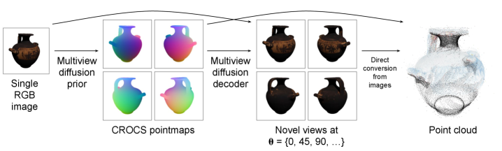
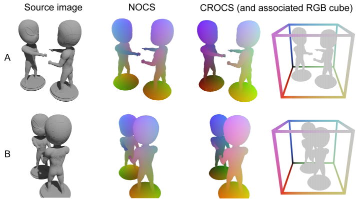

# unPIC Reading Notes

Paper: [How to Spin an Object: First, Get the Shape Right](https://arxiv.org/html/2412.10273v3)  
Project page: [unPIC: A Geometric Multiview Prior](https://unpic.github.io/)

Context: this paper is from Google DeepMind and University College London. It sits after NeRF in the knowledge map: NeRF assumes many posed images and optimizes one scene, while this paper studies **single-image-to-3D** using learned generative priors.

## 0. What Problem Is This Paper Solving?

Input:

```text
one RGB image of an object
```

Output:

```text
multiple consistent novel views
and optionally a colored 3D point cloud
```

The task is hard because a single image is underdetermined:

```text
front view only
-> back side is unknown
-> hidden geometry is ambiguous
-> texture is also ambiguous
```

So the model must hallucinate plausible unseen geometry and appearance while keeping all generated views mutually consistent.

This is different from original NeRF:

| Method family | Input | Training/inference behavior |
| --- | --- | --- |
| NeRF | many posed images of one scene | optimize one scene-specific radiance field |
| unPIC | one image at inference | feed-forward generative model predicts multiview geometry and appearance |

## 1. Main Idea

The paper argues:

```text
To spin an object well, first get the shape right.
```

Instead of directly generating RGB novel views, unPIC factorizes the process:

```text
source image
-> geometry prior
-> multiview geometry representation
-> appearance decoder
-> textured novel views
```



In the paper's language:

```text
Stage 1: geometry prior
    predict object shape across multiple target views

Stage 2: appearance decoder
    use predicted geometry as a blueprint
    generate RGB novel views
```

This is a hierarchical generation pipeline:

```text
image -> 3D geometry -> 3D appearance
```

## 2. Why Hierarchical Generation?

A direct image-to-multiview model has to solve everything at once:

```text
single image
-> unseen shape
-> unseen texture
-> multiview consistency
```

That is too entangled. It can produce images that look plausible individually but do not correspond to one possible 3D object.

unPIC separates concerns:

```text
geometry prior:
    focus on shape and cross-view correspondence

appearance decoder:
    focus on texture and photorealism
    while following the predicted geometry
```

The key intuition:

```text
If the geometry is inconsistent,
the generated RGB views may look good separately
but cannot form a coherent 3D object.
```

## 3. CROCS: Camera-Relative Object Coordinates

The central representation is **CROCS**, short for:

```text
Camera-Relative Object Coordinates
```

CROCS is a dense pointmap. For each pixel in a target view, it stores the normalized 3D coordinate of the visible object point.

```text
pixel -> (X, Y, Z) coordinate in a normalized object cube
```

Because the coordinates are normalized into `[0, 1]`, they can be visualized like RGB images:

```text
X -> red channel
Y -> green channel
Z -> blue channel
```

So a CROCS image is not a normal RGB texture image. It is a geometry image:

```text
RGB-looking image
but each color encodes 3D position
```



## 4. Why Camera-Relative?

The paper contrasts CROCS with NOCS.

NOCS:

```text
Normalized Object Coordinate Space
uses a category-level canonical orientation
```

That means it assumes objects can be aligned to a shared class pose:

```text
all chairs face the canonical front
all arms/legs/parts receive consistent semantic coordinates
```

CROCS instead uses the **source camera** to define the coordinate frame:

```text
coordinate system is relative to the input camera
not relative to an object category
```

This has two benefits:

- It avoids needing object class labels or semantic part alignment.
- The target-view CROCS images have predictable color patterns as the object spins around the source camera.

Mental model:

```text
NOCS:
    object-centric canonical coordinates

CROCS:
    camera-relative scene/object coordinates
```

## 5. Why CROCS Helps

The paper asks two empirical questions:

```text
1. Is this representation useful for predicting novel-view RGB?
2. Is this representation itself easy to predict from a single image?
```

They compare CROCS against:

- depth maps
- alpha masks
- NOCS pointmaps
- DINOv2 features
- CLIP features

Their finding:

```text
CROCS is both useful for appearance decoding
and easier to predict than alternatives like NOCS.
```

The reason is statistical predictability:

```text
because CROCS is source-camera-relative,
each target viewpoint has a consistent coordinate/color pattern across objects.
```

This makes the geometry prior's job easier.

## 6. Multiview Diffusion

Both the geometry prior and appearance decoder are multiview diffusion models.

Instead of generating one view at a time, unPIC predicts `K` target views together.

The paper uses:

```text
K = 8 target views
arranged as a 2 x 4 tiled superimage
```

Why tile views together?

```text
local convolutions:
    share information between neighboring views

self-attention:
    share information globally across all views
```

This helps the model maintain consistency across the full object spin.

## 7. Training and Inference

Training data:

```text
3D assets from Objaverse and ObjaverseXL
rendered into multiple views
```

At training time:

```text
choose one source view
mask the other views
train the prior to predict multiview CROCS
train the decoder to predict multiview RGB conditioned on geometry
```

At inference time:

```text
input one RGB image
-> prior predicts CROCS for target views
-> decoder generates RGB target views
-> CROCS + RGB can be converted to colored point cloud
```

Important distinction from NeRF:

```text
NeRF:
    requires many views at inference/training for one scene
    optimizes per scene

unPIC:
    learns a prior over many objects during training
    at inference, takes one image and predicts novel views feed-forward
```

## 8. Direct Point Cloud Generation

Because CROCS encodes 3D coordinates per pixel, the output can be directly turned into a point cloud:

```text
CROCS target views -> vertices
RGB target views -> vertex colors
```

This avoids a separate post-hoc reconstruction step in some pipelines.

But note:

```text
point cloud != watertight mesh
```

It gives direct 3D points and colors, but mesh extraction or surface reconstruction may still be needed depending on the downstream use.

## 9. Results

The paper reports that unPIC with CROCS improves:

- novel-view synthesis quality
- multiview consistency
- geometric accuracy
- direct 3D point cloud reconstruction

Baselines include:

- CAT3D
- EscherNet
- Free3D
- One-2-3-45
- InstantMesh
- Direct3D

The main empirical message:

```text
geometry-first generation with CROCS
beats directly generating RGB views
or using weaker intermediate geometry representations.
```

## 10. How This Relates to NeRF

NeRF answers:

```text
Given many posed images of one scene,
how can we optimize a continuous 3D radiance field?
```

unPIC answers:

```text
Given one image,
how can a learned prior hallucinate consistent unseen views and geometry?
```

Connection:

```text
Both care about multiview consistency.
Both need a representation that links 2D views to 3D structure.
```

Difference:

```text
NeRF:
    scene-specific optimization
    RGB supervision from many real views
    implicit volumetric field

unPIC:
    feed-forward prediction from one view
    learned from large 3D asset datasets
    intermediate explicit pointmap geometry
```

This paper is useful after NeRF because it shows a modern answer to:

```text
What if we do not have many views at test time?
Can a generative model provide the missing 3D prior?
```

## 11. Key Terms

```python
single-image-to-3D:
    infer/generate 3D object information from one RGB image

novel view synthesis:
    generate images from camera viewpoints not shown in the input

multiview consistency:
    generated views should correspond to one coherent 3D object

geometry prior:
    model that predicts plausible 3D shape from limited observation

appearance decoder:
    model that generates RGB views conditioned on geometry

pointmap:
    image-like map where each pixel stores a 3D point coordinate

CROCS:
    camera-relative normalized 3D coordinates, visualized as RGB-like maps
```

## 12. One-Sentence Summary

```text
unPIC improves single-image-to-3D by first predicting camera-relative multiview geometry with CROCS, then using that geometry as a blueprint for a diffusion decoder that generates consistent textured novel views.
```

## References

- Paper: https://arxiv.org/html/2412.10273v3
- Project page: https://unpic.github.io/
- NeRF note: `3DVision/0_NeRF.md`
