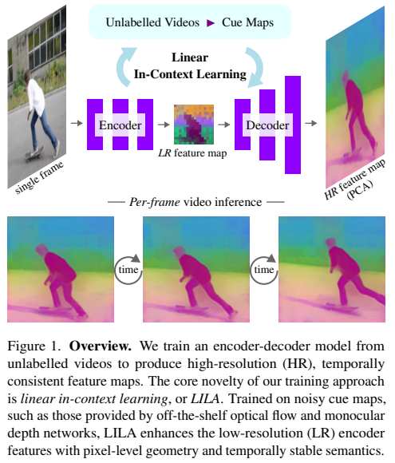
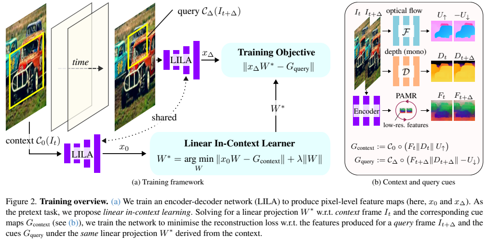
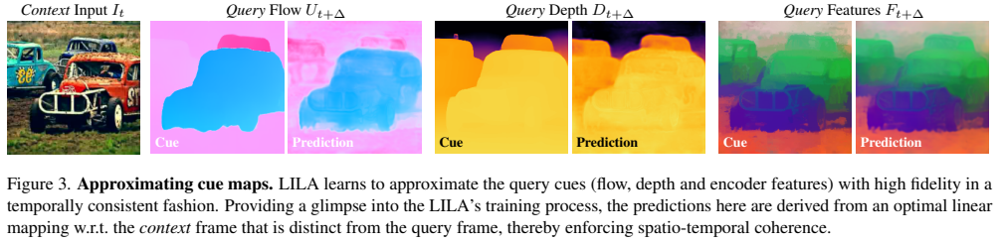
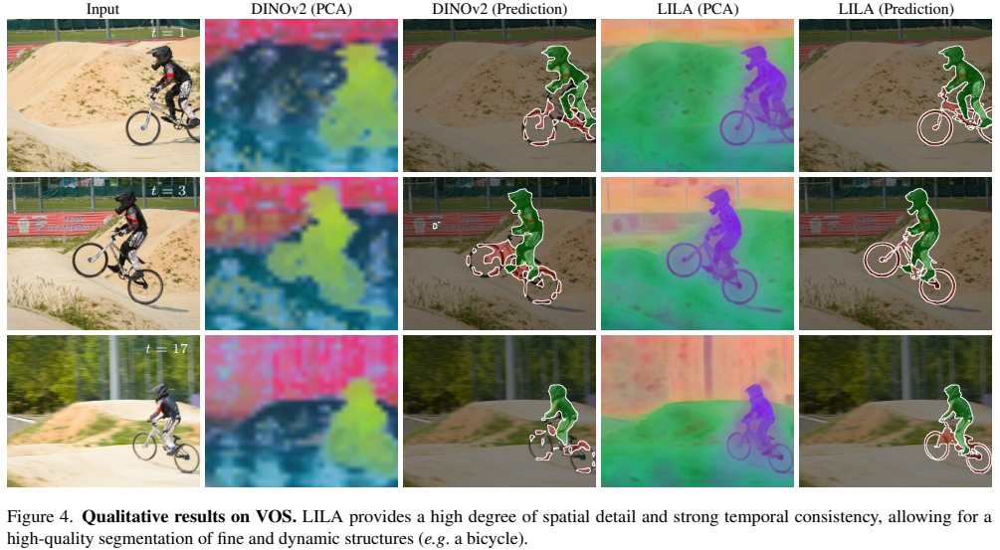
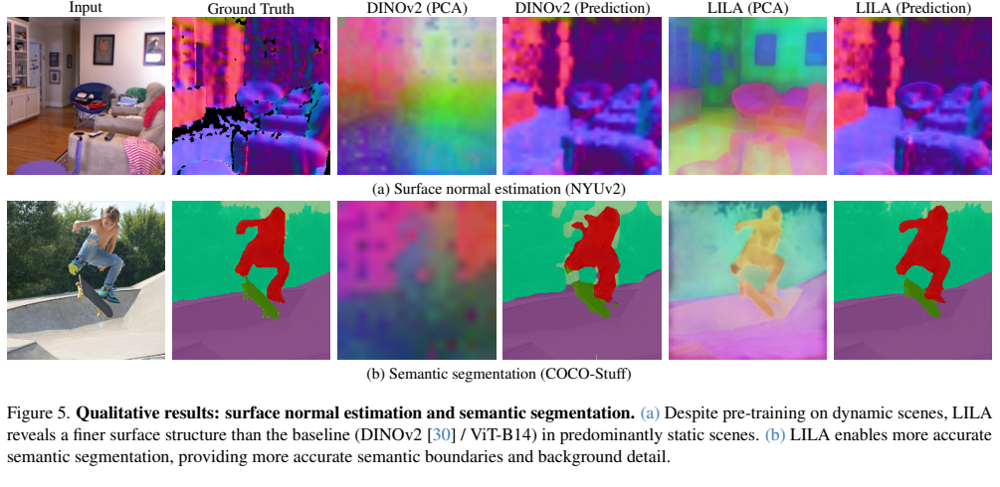
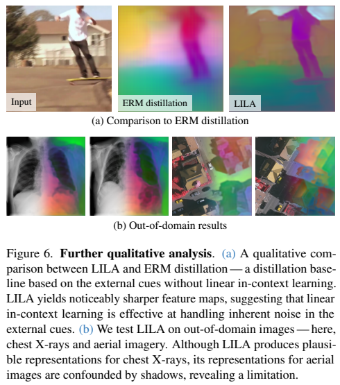
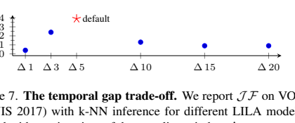

# Featurising Pixels from Dynamic 3D Scenes with Linear In-Context Learners

Paper: [Featurising Pixels from Dynamic 3D Scenes with Linear In-Context Learners](lila_cvpr2026_main.pdf)  
Project page: https://lila-pixels.github.io  
Authors: Nikita Araslanov, Martin Sundermeyer, Hidenobu Matsuki, David Joseph Tan, Federico Tombari

## 0. The Goal

The goal of this paper is to learn **pixel-level visual features** from unlabelled videos.

Given a single RGB image, LILA outputs a dense feature map:

```text
input image:      H x W x 3
LILA features:    H x W x d
```

Each pixel receives a feature vector. The important point is that this vector should not merely be a higher-resolution version of a ViT patch token. It should encode several properties at once:

- **Semantics**: pixels on the same object or object part should have related descriptors.
- **Geometry**: the descriptor should contain information useful for depth, surfaces, and boundaries.
- **Temporal consistency**: the descriptor should remain stable when the same object moves through a video.



The high-level story of Fig. 1 is:

```text
training:
    unlabelled videos
    + noisy cue maps from depth, optical flow, and encoder features
    -> train an encoder-decoder to produce dense pixel features

inference:
    single image
    -> high-resolution feature map
```

A useful detail: depth and optical flow networks are only used during training. At test time, LILA takes one image and directly produces dense features.

## 1. Why Pixel-Level Features?

Many vision tasks need descriptors at the pixel level:

- video object segmentation
- semantic segmentation
- surface normal estimation
- dense correspondence
- tracking and label propagation

Modern vision foundation models such as DINOv2 already produce strong semantic features, but they usually operate at patch resolution:

```text
image -> ViT encoder -> low-resolution patch grid
```

This is a problem for dense tasks. A patch token may understand the object category, but it is too coarse for fine structures such as bicycle spokes, object boundaries, hands, furniture edges, or thin segmentation regions.

A naive solution is to increase the input resolution so that the ViT produces more tokens. But this is expensive and creates a training/inference mismatch. LILA instead trains a decoder on top of a frozen ViT encoder so that the model natively outputs one feature vector per pixel.

## 2. What Is a Pixel Feature?

An RGB pixel stores color:

```text
pixel = [R, G, B]
```

A learned pixel feature stores a richer local descriptor:

```text
pixel = [f_1, f_2, ..., f_d]
```

A good descriptor should behave like a local identity code:

```text
same object / same part / same surface
-> similar feature

different object / opposite side of a boundary
-> different feature
```

This is why the paper is not just about upsampling features. It is about learning a dense representation that supports semantic, geometric, and temporal reasoning.

One way to test whether a feature is useful is to ask:

```text
Can a simple linear readout recover useful visual cues from it?
```

If depth, flow, or semantic cues can be read from a feature with a linear map, then the feature already contains that information in an accessible form.

## 3. The Core Idea: Linear In-Context Learning

LILA samples two frames from a video:

```text
I_t            context frame
I_{t+Delta}    query frame
```

The model produces dense features for both frames:

```text
x_0      = LILA(C_0(I_t))
x_Delta  = LILA(C_Delta(I_{t+Delta}))
```

The key idea is not to directly force these features to equal depth or flow maps. Instead, the paper creates an in-context task:

```text
Fit a linear readout W* on the context frame.
Then reuse the same W* on the query frame.
```



In Fig. 2, the context frame provides both a feature map `x_0` and cue maps `G_context`. LILA solves a small ridge regression problem to obtain the best linear map `W*` from features to cues. Then the same `W*` is applied to the query feature map `x_Delta`, and the model is trained so that `x_Delta W*` matches the query cues `G_query`.

In plain language:

```text
The context frame teaches a temporary translator W*:
    pixel feature -> cue map

The query frame tests whether the same translator still works.
```

If the same translator works across frames, then the feature language is stable across time. If the features only memorize frame-specific noise, the translator will fail on the query frame.

This is the main elegance of the paper: it turns noisy pseudo-labels into a cross-frame consistency test.

## 4. Cue Maps

LILA uses three kinds of cues.

### 4.1 Depth

A monocular depth model predicts:

```text
D_t
D_{t+Delta}
```

Depth encourages the feature map to encode scene geometry.

### 4.2 Optical Flow

An optical flow model predicts forward and backward flow:

```text
U_up      flow from I_t to I_{t+Delta}
U_down    flow from I_{t+Delta} to I_t
```

Flow encourages temporal correspondence. It tells the representation how pixels move across time.

The query cue uses `-U_down` so that its direction is consistent with the forward flow.

### 4.3 Refined Encoder Features

The frozen ViT encoder already contains strong semantic knowledge, but its feature grid is low resolution. LILA therefore also uses encoder features as a self-distillation target.

Before using them as cues, the encoder features are refined with **PAMR**. This makes the coarse feature maps better aligned with image boundaries.

The three cue types are concatenated:

$$
G_{context} := C_0 \circ (F_t \Vert D_t \Vert U^{\uparrow})
$$

$$
G_{query} := C_\Delta \circ (F_{t+\Delta} \Vert D_{t+\Delta} \Vert -U^{\downarrow})
$$

where:

- $F$ is the PAMR-refined encoder feature.
- $D$ is the depth map.
- $U$ is optical flow.
- $C_0$ and $C_\Delta$ are crops.
- $\Vert$ denotes channel-wise concatenation.

The cues are best understood as hints, not clean labels:

```text
depth:            where surfaces are
flow:             how pixels move
encoder feature:  what the pixel probably belongs to
```

Depth and flow are imperfect because they come from off-the-shelf models. The training objective matters because it reduces the tendency to simply absorb their frame-specific noise.

## 5. The LILA Objective

### 5.1 Fit the Context Readout

Given context features $x_0$ and context cues $G_{context}$, LILA first solves:

$$
W^* = \arg\min_W \|x_0 W - G_{context}\| + \lambda \|W\|
$$

This is ridge regression. It asks:

```text
Which linear map best reads the cue map from the context features?
```

The paper notes that this has a closed-form solution and is efficient because the problem size depends on the feature dimension $d$, not directly on the number of pixels $N$.

Conceptually:

```python
W_star = ridge_regression(
    input=x_context_features,
    target=context_cues,
)
```

### 5.2 Reuse the Readout on the Query

The same $W^*$ is then applied to the query features:

$$
L_{L1} = \|x_\Delta W^* - G_{query}\|_1
$$

Conceptually:

```python
query_prediction = x_query_features @ W_star
loss = L1(query_prediction, query_cues)
```

The pressure comes from the fact that $W^*$ was fitted on the context, not on the query. Therefore the query feature map must use the same coordinate system as the context feature map.

### 5.3 Edge Consistency

Cue discontinuities often correspond to semantic or geometric boundaries. LILA therefore adds a gradient matching loss:

$$
L_{\nabla x}
=
\omega_x
\|
\nabla_x(x_\Delta W^*) - \nabla_xG_{query}
\|_1
$$

with:

$$
\omega_x = 1 - \exp(-\nabla_xG_{query}/\sigma)
$$

The vertical direction is handled analogously:

$$
L_\nabla = L_{\nabla x} + L_{\nabla y}
$$

The final objective is:

$$
L_{LILA} = L_{L1} + \gamma L_\nabla
$$

The intuition is simple:

```text
The predicted cue values should match,
and their boundary structure should match too.
```

## 6. What the Training Process Looks Like



Fig. 3 is useful because it shows what the in-context readout is asked to do. The readout is fitted from the context frame, but its predictions are visualized on a different query frame. It reconstructs query flow, query depth, and query encoder features.

This is a direct visualization of the central constraint:

```text
same linear map
+ different frame
-> still recovers the right cues
```

That is why the method encourages spatio-temporal coherence rather than per-frame cue memorization.

## 7. Architecture and Training

The architecture is deliberately conservative:

```text
pre-trained ViT encoder, frozen
+ DPT decoder, trainable
-> pixel-level feature map
```

Important details:

- The backbone is initialized from DINOv2.
- The encoder is frozen.
- Only the DPT decoder is trained.
- The decoder uses skip connections from intermediate ViT blocks.
- Output dimensions are 128, 192, and 256 for ViT-S14, ViT-B14, and ViT-L14 respectively.

Training data:

- YouTube-VOS
- Kinetics-700

The paper does not use their annotations. It only uses the raw videos.

Cue models:

- optical flow: SEA-RAFT
- depth: DepthAnythingV2

At inference time:

```text
single image -> LILA -> dense feature map
```

The depth and flow networks are discarded.

## 8. Experiments

The paper evaluates LILA on tasks that are not identical to the training cues:

1. video object segmentation
2. surface normal estimation
3. semantic segmentation

This is important. If the method only improved depth prediction or flow prediction, it might just be learning to imitate the cue models. These downstream tasks show whether the representation is broadly useful.

## 9. Video Object Segmentation

Dataset: DAVIS-2017 validation set.

Evaluation protocols:

- linear probing
- local k-NN label propagation



VOS is a strong test of temporal feature consistency. The model receives the mask in the first frame, then must propagate the label to later frames using features.

The key question is:

```text
Does the feature of the same object remain similar as the object moves?
```

The bicycle example in Fig. 4 is especially informative. Thin and dynamic structures are difficult for coarse patch features. LILA preserves more spatial detail, so the segmentation follows the bicycle and rider more cleanly.

Quantitatively, LILA improves DINOv2-S14 from:

```text
linear probing J&F: 57.5 -> 68.6
local k-NN J&F:    65.1 -> 73.9
```

For DINOv2-B14:

```text
linear probing J&F: 61.6 -> 70.4
local k-NN J&F:    66.4 -> 74.2
```

This is particularly notable because LILA does not use mask supervision, while some feature upsampling baselines rely on stronger mask-related supervision.

## 10. Surface Normal Estimation and Semantic Segmentation



### 10.1 Surface Normal Estimation

Dataset: NYUv2.

The probe maps each pixel feature to a 3D normal vector.

This task tests whether the representation contains geometry, not merely object categories. A feature that only knows “chair”, “wall”, or “floor” may not recover detailed surface orientation.

Representative results:

```text
DINOv2-B14 RMSE:        26.56
DINOv2-B14 + LILA RMSE: 25.71

DINOv2-L14 RMSE:        24.70
DINOv2-L14 + LILA RMSE: 24.12
DINOv2-L14 + Kinetics:  24.04
```

The improvement indicates that depth and video geometry are actually entering the dense descriptor.

### 10.2 Semantic Segmentation

Dataset: COCO-Stuff with 27 coarse categories.

Semantic segmentation requires both category-level understanding and accurate spatial boundaries. DINOv2 already has strong semantics, but its feature grid is coarse. LILA brings that semantic information back to pixel resolution.

Representative mIoU results:

```text
DINOv2-S14:        56.6
DINOv2-S14 + LILA: 59.6

DINOv2-B14:        58.5
DINOv2-B14 + LILA: 62.4

DINOv2-L14:        58.7
DINOv2-L14 + LILA: 62.8
DINOv2-L14 + Kinetics: 63.3
```

The qualitative examples in Fig. 5 show sharper semantic boundaries and more detailed predictions.

## 11. Ablations and Analysis



The ablations are important because they separate two hypotheses:

```text
Hypothesis A:
    The gains come from the external cue maps themselves.

Hypothesis B:
    The gains come from the linear in-context training formulation.
```

The ERM distillation baseline supports Hypothesis B. Directly distilling the cue maps performs much worse than LILA.

For VOS local k-NN:

```text
ERM distillation: 61.1 J&F
Full LILA:        73.9 J&F
```

This is the central evidence that LILA is not just copying depth and flow. The cross-frame linear readout objective is doing real work.

The cue modality ablation also shows that the cues are complementary:

```text
self-distillation: preserves semantics
flow:              improves temporal correspondence
Depth:             improves geometric structure
```

The full combination is the most stable across tasks.

### 11.1 Temporal Gap



The temporal gap $\Delta$ controls task difficulty:

- If $\Delta$ is too small, the query is too easy and the representation learns less.
- If $\Delta$ is too large, cue prediction becomes too difficult.

The best performance comes from an intermediate gap.

## 12. Limitations

LILA depends on off-the-shelf cue models:

- depth must be plausible
- optical flow must be plausible

This limits where the method can be applied. If depth or flow estimation fails badly, the training signal also degrades.

The paper shows out-of-domain examples in Fig. 6. Chest X-rays still produce plausible representations, but aerial imagery can be confused by shadows.

## 13. My Understanding

The best way to understand LILA is:

```text
A good pixel representation should support a simple linear translator.
That translator should work not only on the frame where it was fitted,
but also on nearby frames.
```

This is stronger than direct distillation. Direct distillation says:

```text
predict this noisy cue for this frame
```

LILA says:

```text
learn a feature language where the same readout rule transfers across time
```

This naturally favors stable visual properties:

- object identity
- semantic boundary
- surface geometry
- motion correspondence

Frame-specific pseudo-label noise is less likely to survive the cross-frame readout test.

## 14. Relation to Alignment and Correspondence

For alignment, the paper is valuable because it suggests that dense correspondence does not always need to be learned as explicit point matching.

Instead, one can first learn a pixel-level representation where corresponding pixels are already close or linearly interpretable.

```text
DINOv2:
    strong semantic abstraction,
    but coarse patch grid

LILA:
    semantic abstraction from the frozen encoder
    + pixel detail from the decoder
    + temporal/geometric consistency from video cues
```

This makes LILA naturally relevant for:

- pixel correspondence
- video label propagation
- object tracking
- dense matching
- temporally consistent segmentation

## 15. Key Takeaways

- LILA learns pixel-level features from unlabelled videos.
- It freezes a pre-trained ViT encoder and trains a DPT decoder.
- Training uses noisy cues from depth, optical flow, and refined encoder features.
- The core objective is linear in-context learning:

```text
fit W* on context feature -> context cue
apply same W* on query feature -> query cue
```

- This objective is much stronger than direct cue distillation.
- At inference, LILA only needs a single image.
- It improves VOS, surface normal estimation, and semantic segmentation.
- For alignment, LILA is useful because it produces dense, temporally consistent, geometry-aware pixel descriptors.
