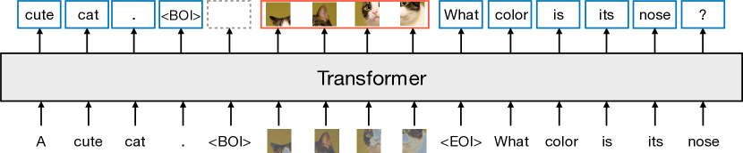
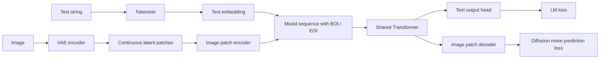
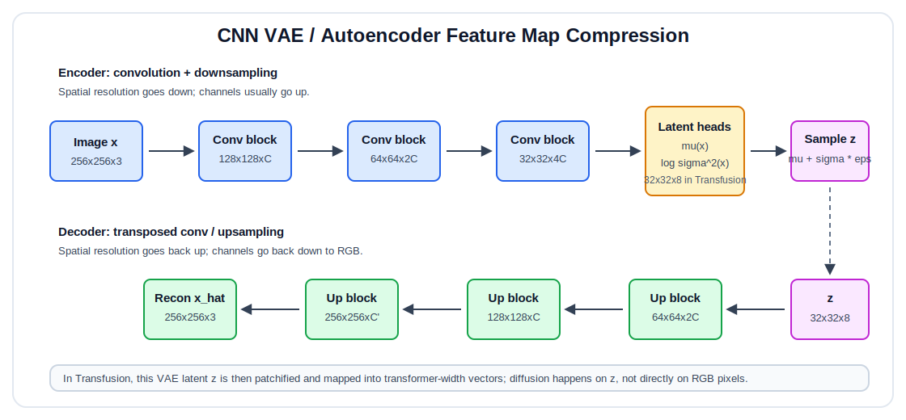
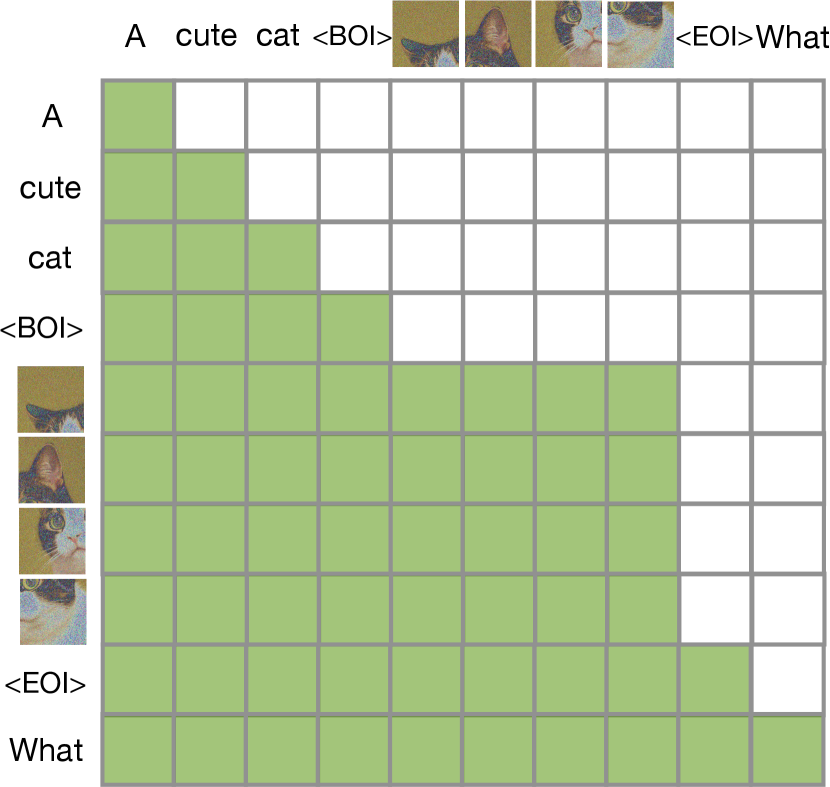
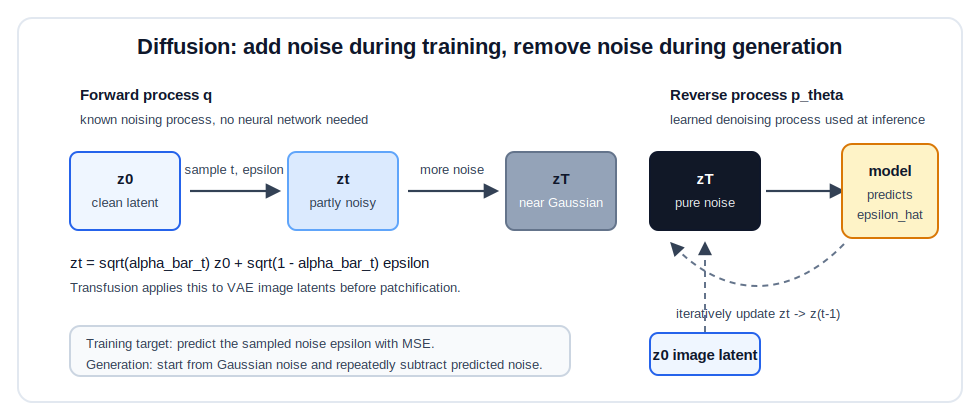
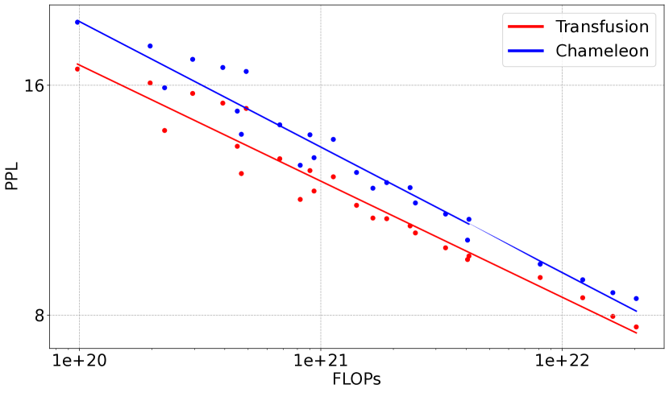
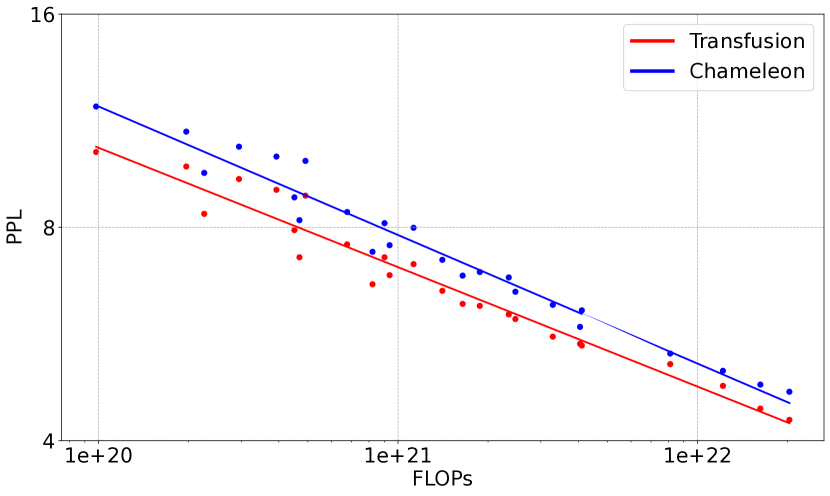
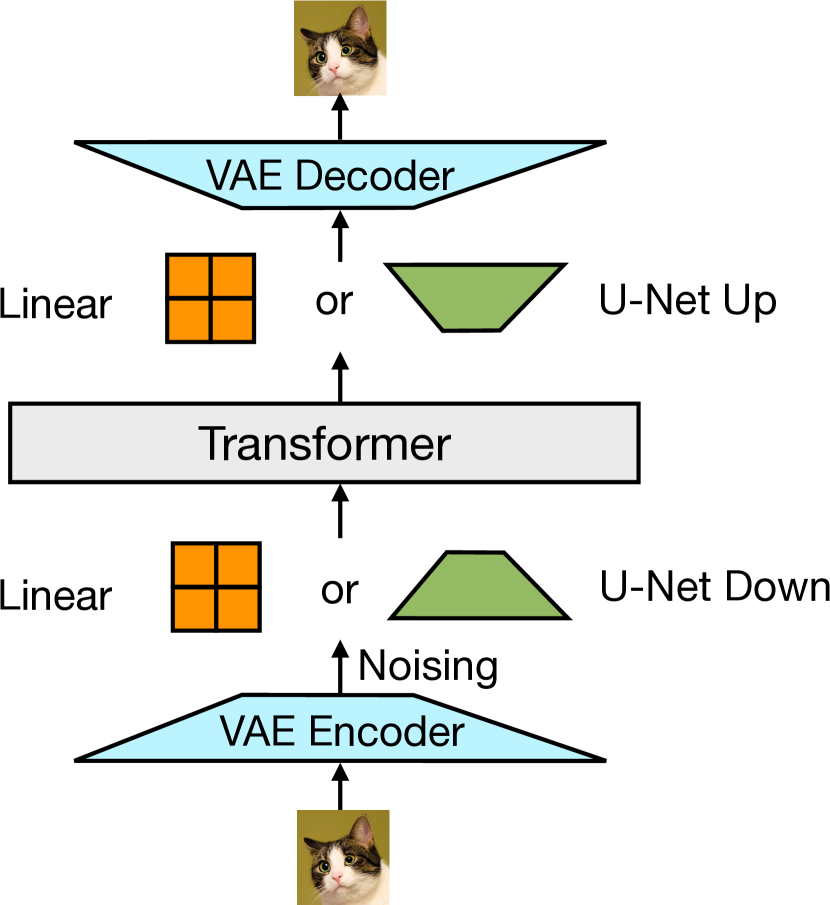
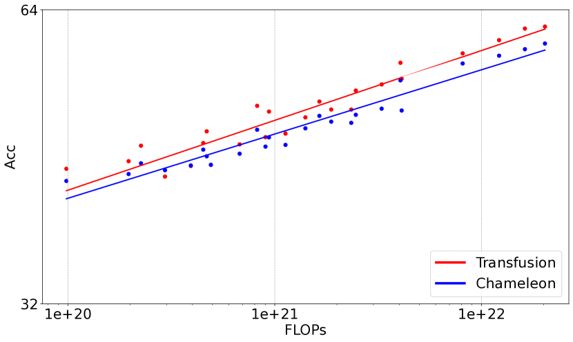

# Transfusion Reading Notes

Paper: [Transfusion: Predict the Next Token and Diffuse Images with One Multi-Modal Model](https://arxiv.org/abs/2408.11039)  
HTML: [ar5iv version](https://ar5iv.labs.arxiv.org/html/2408.11039v1)

Context: this paper comes from Meta, Waymo, and USC. It sits in the line of work after large language models, latent diffusion models, and mixed-modal models such as Chameleon. The key question is:

```text
Can one transformer model both:
    1. predict discrete text tokens autoregressively,
    2. generate continuous images with diffusion,
without first quantizing images into discrete image tokens?
```

The paper's answer is **Transfusion**: keep text discrete, keep images continuous, and train one shared transformer with modality-specific losses.

## 0. The Goal

Given mixed-modal sequences containing text and images,

$$
s = [\text{text tokens}, \text{image latent patches}, \text{text tokens}, \dots],
$$

Transfusion trains one transformer that can generate either modality:

```text
text -> text
text -> image
image -> text
image + instruction -> edited image
```

The important shift is this:

```text
not: convert everything into discrete tokens
but: use the natural modeling objective for each modality

text  -> next-token prediction
image -> diffusion over continuous latent patches
```

High-level architecture:



Figure 1 is the shortest version of the whole paper: text tokens are predicted autoregressively, while image patches inside `<BOI> ... <EOI>` are processed in parallel and trained with a diffusion objective. The transformer in the middle is shared.



The central claim:

<span style="color:red">Images should not have to become vocabulary items just so a language model can process them.</span>

## 1. Why Not Just Tokenize Images?

A common recipe for multimodal generation is:

```text
image
-> VQ-VAE / tokenizer
-> discrete image tokens
-> train a language model over text tokens + image tokens
```

This is the Chameleon-style approach. It is architecturally elegant because everything becomes next-token prediction, but it introduces an information bottleneck:

```text
continuous image latent
-> nearest codebook entry
-> discrete token id
```

Quantization makes images fit the language modeling interface, but some continuous detail is lost. Transfusion instead keeps the image representation continuous and uses diffusion, which is already strong for continuous media generation.

| Modality | Data type | Natural objective | Transfusion choice |
|---|---:|---|---|
| Text | discrete token ids | next-token classification | LM loss |
| Image | continuous latent vectors | denoising / diffusion | diffusion loss |

So the model is unified at the transformer level, not at the loss level.

## 2. Data Representation

Text is represented in the usual way:

$$
x^{txt} = (x_1, x_2, \dots, x_n), \quad x_i \in \{1,\dots,V\}
$$

where $V$ is the vocabulary size.

### 2.1 Classic VAE / Image Autoencoder Flow

Images are first encoded by a VAE into latent tensors. Before looking at Transfusion's patch representation, it helps to separate the **VAE compression stage** from the **transformer patch stage**.



This figure is a **conceptual VAE / latent autoencoder diagram**, The Transfusion paper uses a pretrained VAE-style image compressor; lucidrains' code keeps this part configurable through `modality_encoder` and `modality_decoder`.

Classic VAE idea:

```text
encoder q_phi(z | x):
    image x -> feature maps -> mu(x), sigma(x)

reparameterization:
    z = mu + sigma * epsilon, epsilon ~ N(0, I)

decoder p_theta(x | z):
    z -> upsampled feature maps -> reconstructed image x_hat
```

For image VAEs, the encoder and decoder are usually convolutional. The encoder does **not** first make independent ViT-style patches. Instead, it applies convolution/downsampling blocks that gradually shrink the spatial feature map.

```text
Example CNN encoder shape intuition:

256 x 256 x 3
-> conv/downsample
-> 128 x 128 x C
-> conv/downsample
-> 64 x 64 x 2C
-> conv/downsample
-> 32 x 32 x 4C
-> projection
-> 32 x 32 x 8 latent
```

The decoder mirrors this:

```text
32 x 32 x 8 latent
-> upsample/conv
-> 64 x 64
-> upsample/conv
-> 128 x 128
-> upsample/conv
-> 256 x 256 x 3 reconstructed image
```

The compression is large. In Transfusion's setup:

$$
256 \times 256 \times 3 = 196{,}608
$$

pixel values become:

$$
32 \times 32 \times 8 = 8{,}192
$$

latent values. That is about:

$$
\frac{196{,}608}{8{,}192}=24
$$

times fewer scalar values before the transformer even sees the image.

Important distinction:

```text
Classical textbook VAE:
    encoder predicts mu and sigma
    z = mu + sigma * epsilon
    KL loss regularizes z toward N(0, I)

Modern latent diffusion autoencoder:
    often behaves more like a perceptual image compressor
    image -> compact latent grid
    diffusion model is trained on that latent grid
```

Transfusion follows the latent diffusion style: the VAE is a pretrained image compressor/decompressor, and the transformer-diffusion model works in the VAE latent space.

After reading the code, the safest implementation-level view is:

```text
paper concept:
    image -> pretrained VAE encoder -> latent grid -> patch encoder -> transformer

Opensource code:
    raw modality or latent tensor
    -> optional modality_encoder
    -> latent_to_model projection
    -> transformer
    -> model_to_latent projection
    -> optional modality_decoder
```

So the VAE/CNN part is not mandatory in the code. 
```text
    image -> CNN VAE encoder -> latent feature map -> latent patches
```

### 2.2 Transfusion's Image Latent Representation



```text
256 x 256 RGB image
-> VAE encoder
-> 32 x 32 x 8 latent tensor
```

Do not read `32 x 32 x 8` as 8192 transformer tokens. There are three different quantities here:

```text
latent scalar values:
    32 x 32 x 8 = 8192 numbers

latent spatial locations:
    32 x 32 = 1024 locations

feature dimension per latent location:
    8 channels
```

So the VAE output can be viewed as:

```text
1024 continuous latent vectors
each vector has 8 dimensions
```
The image is still continuous after this process. The patch vector is not a vocabulary id; it is a real-valued vector that diffusion can denoise.

Then the latent tensor is split into **latent patches**. Each latent patch becomes one transformer image sequence element after the patch encoder. Depending on the latent patch size, one image can become:

| Latent patch size | Latent patch scalar values | Pixel region covered | Transformer image tokens per image |
|---:|---:|---:|---:|
| $1 \times 1$ | $1 \times 1 \times 8 = 8$ | $8 \times 8$ | $32 \times 32 = 1024$ |
| $2 \times 2$ | $2 \times 2 \times 8 = 32$ | $16 \times 16$ | $16 \times 16 = 256$ |
| $4 \times 4$ | $4 \times 4 \times 8 = 128$ | $32 \times 32$ | $8 \times 8 = 64$ |
| $8 \times 8$ | $8 \times 8 \times 8 = 512$ | $64 \times 64$ | $4 \times 4 = 16$ |

Important vocabulary:

```text
8192:
    number of scalar values in the VAE latent tensor

1024:
    number of latent spatial locations before extra patch compression

1024 / 256 / 64 / 16:
    possible numbers of transformer image tokens, depending on latent patch size
```

So the most common confusion is:

```text
wrong:
    32 x 32 x 8 latent tensor = 8192 image tokens

right:
    32 x 32 x 8 latent tensor = 8192 scalar values
    if using 1 x 1 latent patches, this becomes 1024 image tokens
    if using 2 x 2 latent patches, this becomes 256 image tokens
```

Mixed sequences use special boundary tokens:

```text
caption text <BOI> image latent patches <EOI> more text
```

Example:

```text
"a red chair beside a window"
<BOI>
z_1, z_2, ..., z_m
<EOI>
```

where each $z_j \in \mathbb{R}^d$ is a continuous image patch vector, not a token id.

## 3. One Transformer, Modality-Specific Interfaces

Most parameters live in one shared transformer. Around it are small modality-specific components.

```text
Text input:
    token id -> embedding vector -> transformer

Image input:
    latent patches -> image encoder -> transformer

Text output:
    transformer state -> vocabulary logits

Image output:
    transformer state -> image decoder -> predicted diffusion noise
```

In code-like form:

```python
def transfusion_forward(sequence):
    h = []

    for item in sequence:
        if item.type == "text_token":
            h.append(text_embedding(item.token_id))
        elif item.type == "image_patches":
            h.extend(image_patch_encoder(item.noisy_latent_patches, item.timestep))

    y = shared_transformer(h, attention_mask=transfusion_mask(sequence))

    text_logits = text_head(y[text_positions])
    predicted_noise = image_decoder(y[image_positions])

    return text_logits, predicted_noise
```

The paper tests two image encoder/decoder designs:

| Image enc/dec | What it does | Trade-off |
|---|---|---|
| Linear | map patch vectors with simple linear layers | simple, few extra params |
| U-Net down/up blocks | compress/decompress image patches with convolutional inductive bias | better image results, extra params |

Important detail: with U-Net blocks, the added parameters are about 0.27B. For the 7B model this is only about 3.8% extra parameters.

## 4. Language Modeling Objective

For text, Transfusion uses standard autoregressive next-token prediction.

Given text tokens:

$$
x_1, x_2, \dots, x_n,
$$

the model factorizes:

$$
p_\theta(x_1,\dots,x_n)
=
\prod_{i=1}^{n} p_\theta(x_i \mid x_{<i})
$$

The LM loss is cross-entropy:

$$
\mathcal{L}_{LM}
=
-\sum_{i \in \mathcal{T}}
\log p_\theta(x_i \mid x_{<i})
$$

where $\mathcal{T}$ is the set of text-token positions that should receive text loss.

Mental model:

```text
prefix tokens
-> transformer hidden state
-> vocabulary distribution
-> cross entropy with the true next token
```

This is exactly the ordinary LLM training objective.

## 5. Diffusion Objective for Images

For images, Transfusion does not predict the next image patch as a discrete token. Instead, it learns to denoise continuous image latents.



Let $z_0$ be the clean image latent patches from the VAE. The diffusion forward process samples a timestep $t$ and Gaussian noise:

$$
\epsilon \sim \mathcal{N}(0, I)
$$

Then it creates a noised version:

$$
z_t
=
\sqrt{\bar{\alpha}_t} z_0
+
\sqrt{1-\bar{\alpha}_t}\epsilon
$$

where $\bar{\alpha}_t$ comes from the noise schedule.

The model predicts the noise:

$$
\hat{\epsilon}_\theta
=
\epsilon_\theta(z_t, t, \text{context})
$$

and the diffusion loss is:

$$
\mathcal{L}_{diff}
=
\mathbb{E}_{z_0,t,\epsilon}
\left[
\left\|
\epsilon - \epsilon_\theta(z_t,t,\text{context})
\right\|_2^2
\right]
$$

Mental model:

```text
clean image latent z_0
-> add noise to get z_t
-> transformer sees noisy image patches + surrounding text context
-> image decoder predicts the noise epsilon
-> MSE loss teaches denoising
```

This is why the output target for image patches is not "which image token comes next?" The output target is "what noise was added?"

## 6. Combined Transfusion Loss

The paper simply adds the modality losses:

$$
\mathcal{L}
=
\mathcal{L}_{LM}
+
\lambda \mathcal{L}_{diff}
$$

where $\lambda$ balances text and image losses. The paper uses:

$$
\lambda = 5
$$

The training computation looks like this:

```text
mixed sequence
    text positions:
        compute next-token cross entropy
    image spans:
        add diffusion noise
        compute denoising MSE

sum both losses
backprop through the same transformer
```

This is the core idea of Transfusion:

<span style="color:red">Use one shared model, but do not force all modalities to use the same probability space.</span>

## 7. Transfusion Attention Mask

Text should be causal:



```text
token i can attend to tokens <= i
token i cannot see future text
```

Images are different. A patch in the top-left of an image should be allowed to communicate with a patch in the bottom-right of the same image. Images are not naturally one-dimensional sequences in the same way text is.

Figure 4 is especially useful because it shows the paper's main masking trick:

```text
outside an image span:
    standard causal triangle

inside one image span:
    full bidirectional block
```

Transfusion combines both patterns:

```text
causal attention across the whole mixed sequence
+ bidirectional attention inside each image span
```

Attention mask intuition:

```text
Text before image:
    can attend to earlier text only

Image patch inside current image:
    can attend to previous context
    can attend to all patches in the same image
    cannot attend to future text or future images

Text after image:
    can attend to previous text and the completed image
```

Diagram:

```text
Sequence:
    t1  t2  <BOI>  p1  p2  p3  p4  <EOI>  t3

Allowed attention:
    t1  -> t1
    t2  -> t1, t2
    p1  -> t1, t2, <BOI>, p1, p2, p3, p4
    p2  -> t1, t2, <BOI>, p1, p2, p3, p4
    p3  -> t1, t2, <BOI>, p1, p2, p3, p4
    p4  -> t1, t2, <BOI>, p1, p2, p3, p4
    t3  -> everything before t3
```

Matrix view:

```text
          attend to ->
query    t1 t2 BOI p1 p2 p3 p4 EOI t3
t1       X
t2       X  X
BOI      X  X  X
p1       X  X  X   X  X  X  X
p2       X  X  X   X  X  X  X
p3       X  X  X   X  X  X  X
p4       X  X  X   X  X  X  X
EOI      X  X  X   X  X  X  X   X
t3       X  X  X   X  X  X  X   X  X
```

The ablation result is strong: with linear image encoding, switching from causal-only to intra-image bidirectional attention improves MS-COCO FID from 61.3 to 20.3.

## 8. Inference: Switching Between LM and Diffusion

Generation alternates between two modes.

### Text Mode

The model behaves like a normal language model:

```text
sample one token
append it to the sequence
repeat
```

If the sampled token is not `<BOI>`, stay in text mode.

### Image Mode

When the model emits `<BOI>`, it switches to diffusion mode:

```text
append pure Gaussian noise as image patches
for t = T, T-1, ..., 1:
    predict noise with the transformer
    denoise current image patches
    overwrite the image span with the less noisy patches
append <EOI>
return to text mode
```

In code-like form:

```python
while not done:
    token = sample_next_text_token(sequence)
    sequence.append(token)

    if token == BOI:
        z_t = gaussian_noise(shape=image_patch_shape)
        sequence.append(z_t)

        for t in reversed(diffusion_steps):
            eps_hat = model.predict_noise(sequence, timestep=t)
            z_t = diffusion_step(z_t, eps_hat, t)
            sequence.replace_current_image(z_t)

        sequence.append(EOI)
```

The subtle point:

```text
The model does not store all previous diffusion timesteps in the sequence.
At each denoising step, the current noisy image span is overwritten.
```

So image generation is iterative like diffusion, while text generation is incremental like a language model.

## 9. Training Examples and Directionality

The paper trains on both text and image data with a 1:1 text/image token ratio in most experiments.

For image-caption pairs:

```text
80% caption first:
    caption -> image

20% image first:
    image -> caption
```

This exposes the model to both:

```text
text-to-image generation
image-to-text captioning
```

However, if image-first examples use heavily noised images, captioning becomes harder because the downstream text conditions on corrupted visual information. The paper tests limiting the maximum noise for image-first cases, which improves CIDEr captioning with little effect on other metrics.

## 10. Controlled Comparison with Chameleon

The most important baseline is Chameleon:



```text
Chameleon:
    image -> VQ-VAE discrete image tokens
    text tokens + image tokens -> one autoregressive LM objective

Transfusion:
    image -> continuous VAE latent patches
    text tokens -> LM loss
    image patches -> diffusion loss
```

At 7B parameters and 0.5T training tokens, the paper reports:

| Model | C4 PPL ↓ | Wiki PPL ↓ | Llama Eval Acc ↑ | COCO CIDEr ↑ | COCO FID ↓ | COCO CLIP ↑ |
|---|---:|---:|---:|---:|---:|---:|
| Transfusion | 7.72 | 4.28 | 61.5 | 27.2 | 16.8 | 25.5 |
| Chameleon | 8.41 | 4.69 | 59.1 | 18.0 | 29.6 | 24.3 |

The estimated Transfusion compute needed to match Chameleon 7B is:

| Metric | Parity FLOP ratio |
|---|---:|
| C4 PPL | 0.489 |
| Wiki PPL | 0.526 |
| Llama Eval Acc | 0.600 |
| COCO CIDEr | 0.218 |
| COCO FID | 0.029 |
| COCO CLIP | 0.319 |

Interpretation:

```text
For FID, Transfusion reaches Chameleon-level image generation quality
with about 2.9% of Chameleon's FLOPs in the controlled scaling fit.
```

The paper's broader empirical message:

<span style="color:red">Diffusing continuous image latents scales better than forcing images through discrete token prediction.</span>

## 11. Patch Size and U-Net Encoders

Larger patches reduce sequence length:

```text
1024 patches per image -> expensive attention
256 patches per image  -> cheaper
64 patches per image   -> much cheaper
16 patches per image   -> very cheap
```

But compressing an image into fewer sequence elements makes each element carry more local visual information. A simple linear projection struggles more with this compression.

The paper finds:

- Linear encoders degrade as patch size grows.
- U-Net down/up blocks make large patches much more viable.
- With U-Net blocks, even 16 patches per image can keep strong image generation quality.

Key 0.76B ablation results:

| Enc/Dec | Patches per image | COCO CIDEr ↑ | COCO FID ↓ | COCO CLIP ↑ |
|---|---:|---:|---:|---:|
| Linear | 256 | 16.0 | 20.3 | 24.0 |
| Linear | 64 | 14.3 | 25.6 | 22.6 |
| Linear | 16 | 11.3 | 43.5 | 18.9 |
| U-Net | 256 | 25.4 | 16.7 | 25.4 |
| U-Net | 64 | 29.9 | 16.0 | 25.7 |
| U-Net | 16 | 29.5 | 16.1 | 25.2 |

Mental model:

```text
Linear patch encoder:
    asks the transformer to learn almost all local image structure

U-Net patch encoder:
    provides local image inductive bias before and after the transformer
```

This is similar to how latent diffusion models benefit from image-native architectures, even when the global conditioning model is a transformer.

## 12. Large-Scale Result

The large model:



```text
7B transformer
+ 0.27B U-Net encoder/decoder layers
trained from scratch on 2T multimodal tokens
    1T text tokens
    about 3.5B image-caption pairs worth of image patches
```

Reported comparison:

| Model | Text tokens | Images | Llama Eval Acc ↑ | COCO FID ↓ | GenEval ↑ |
|---|---:|---:|---:|---:|---:|
| Chameleon 7B | 6.0T | 3.5B | 67.1 | 26.74 | 0.39 |
| SDXL | - | 1.6B | - | - | 0.55 |
| DeepFloyd | - | 7.5B | - | 6.66 | 0.61 |
| SD 3 | - | ~2.0B | - | - | 0.68 |
| Transfusion 7.3B | 1.0T | 3.5B | 66.1 | 6.78 | 0.63 |

The interesting part is not that Transfusion beats every specialized image model. It does not. SD 3 has a higher GenEval score in the table.

The interesting part is:

```text
Transfusion is one model that can generate both text and images,
while reaching image quality in the same ballpark as strong diffusion models.
```

The generated samples matter because they show the paper is not only reporting proxy metrics. The model is trained as one mixed-modal model, but the image path still produces visually plausible samples after diffusion decoding.

## 13. Image Editing



The paper also tests whether the same pretrained model can adapt to image-to-image generation. They fine-tune the 7B model on only 8k image editing examples:

```text
input image + edit instruction
-> output image
```

This is not the main training setup, but it is a useful sanity check: once text and image can both appear in the same sequence, new modality combinations become natural fine-tuning tasks.

## 14. How This Relates to Diffusion and LLMs

LLMs answer:

```text
Given previous discrete symbols,
what is the next symbol?
```

Diffusion models answer:

```text
Given a noisy continuous sample,
what noise should be removed?
```

Transfusion says:

```text
Use both questions inside one transformer.
```

Comparison:

| Model family | Text handling | Image handling | Core limitation |
|---|---|---|---|
| LLM only | strong | images must become tokens or external tools | continuous media bottleneck |
| Latent diffusion | text as conditioning | strong image generation | usually not a full text generator |
| Chameleon-style AR multimodal | text and image both as tokens | image tokens via VQ | quantization + huge token sequences |
| Transfusion | LM loss | diffusion loss over continuous latents | more complex decoding and masking |

## 15. What Is Actually Being Learned?

The shared transformer must learn representations useful for both:

```text
predicting text distributions
and
predicting image denoising directions
```

For a mixed training example:

```text
"a small boat on a lake" <BOI> image <EOI>
```

the training graph is:

```text
caption tokens
-> text embeddings

clean image
-> VAE latent z_0
-> add noise to z_t
-> patch encoder

mixed sequence
-> shared transformer

text positions:
    logits -> cross entropy

image positions:
    predicted noise -> MSE against true noise

total loss:
    L_LM + lambda L_diff
```

Gradients from both objectives update the same transformer parameters:

```text
text loss gradients
    teach syntax, knowledge, autoregressive semantics

diffusion loss gradients
    teach visual denoising, layout, appearance, caption-image grounding
```

The paper's bet is that these gradients are compatible enough that sharing parameters is efficient.

## 16. Important Subtleties

### <span style="color:red">BOI Has No LM Loss<span>

The paper notes that when the input is a BOI token, they do not compute LM loss. Conceptually, BOI is a mode switch into image generation, not an ordinary text target in the same way.

### <spain style="color:red">Images Are Noisy During Training <spain>

The transformer conditions on noised image latents during training, because diffusion training corrupts the image span. This matters for image-to-text examples: if the image appears before the caption, the caption may condition on a noisy version of the image.
<spain style="color:red"> So if for the image caption task, will ristrict the maximum noise. <spain>

### One Sequence, Two Time Notions

There are two different notions of "time":

```text
Sequence time:
    token / patch position in the mixed sequence

Diffusion time:
    noise timestep t for image denoising
```

A text token uses sequence position and causal masking. An image patch uses sequence position, intra-image bidirectional attention, and diffusion timestep embedding.

## 17. Strengths

- Avoids lossy image quantization.
- Keeps a single shared transformer backbone.
- Allows arbitrary mixtures of text and image generation.
- Scales better than a controlled Chameleon-style discrete-image-token baseline.
- U-Net image interfaces make aggressive image compression possible.

## 18. Limitations and Open Questions

- Training and decoding are more complex than a pure autoregressive model.
- Image generation still needs iterative diffusion steps, so image decoding is not one-token-at-a-time cheap.
- The balance coefficient $\lambda$ is not deeply explored.
- The paper focuses on images and text; audio/video are natural next targets but not demonstrated here.
- It is still unclear how much text/image interference appears at larger scales or different data mixtures.
- U-Net encoders improve image quality but add image-specific inductive bias, so the architecture is not perfectly modality-agnostic.

## 19. Minimal Pseudocode

Training:

```python
def train_step(batch):
    sequence = []
    text_targets = []
    image_noise_targets = []

    for item in batch.mixed_items:
        if item.is_text:
            token_ids = tokenize(item.text)
            sequence.extend(token_ids)
            text_targets.extend(next_token_targets(token_ids))

        if item.is_image:
            z0 = vae_encode(item.image)
            t = sample_diffusion_timestep()
            eps = normal_like(z0)
            zt = sqrt(alpha_bar[t]) * z0 + sqrt(1 - alpha_bar[t]) * eps

            sequence.append(BOI)
            sequence.extend(patchify(zt))
            sequence.append(EOI)
            image_noise_targets.append(eps)

    text_logits, eps_hat = transfusion(sequence)

    loss_lm = cross_entropy(text_logits, text_targets)
    loss_diff = mse(eps_hat, image_noise_targets)

    loss = loss_lm + lambda_ * loss_diff
    loss.backward()
```

Generation:

```python
def generate(prefix):
    sequence = tokenize(prefix)

    while not finished(sequence):
        token = sample_text_token(transfusion(sequence).text_logits)
        sequence.append(token)

        if token == BOI:
            z = normal(image_latent_shape)

            for t in reversed(diffusion_schedule):
                eps_hat = transfusion(sequence + patchify(z), timestep=t).eps_hat
                z = denoise_step(z, eps_hat, t)

            sequence.extend(patchify(z))
            sequence.append(EOI)

    return decode_mixed_sequence(sequence)
```

## 20. Code Reference: lucidrains/transfusion-pytorch

Repo: [lucidrains/transfusion-pytorch](https://github.com/lucidrains/transfusion-pytorch)

This repo is useful for mapping the paper idea into actual PyTorch objects, but there is one important caveat:

```text
Paper:
    text -> autoregressive LM loss
    image -> diffusion noise-prediction loss

lucidrains implementation:
    text -> autoregressive LM loss
    continuous modalities -> flow matching loss
```

The README explicitly says the implementation substitutes diffusion with flow matching, inspired by newer image generators such as Flux. So it is not a line-by-line implementation of the paper's DDPM-style objective, but the sequence construction and mixed-modality transformer idea are very close.

### 20.1 Input Convention

The repo uses tensor dtype to distinguish text from continuous modalities:

```python
# torch.long / torch.int means text tokens
text = randint(0, 256, (16,))

# torch.float means a continuous modality span
image_latents = randn(4, 384)

sample = [
    text,
    image_latents,
    randint(0, 256, (8,)),
    randn(6, 384),
]
```

For multiple modalities, a continuous tensor can be wrapped as:

```python
(modality_index, tensor)
```

Example:

```python
text_images_and_audio = [
    randint(0, 256, (16,)),
    (0, randn(4, 384)),   # modality 0, e.g. image
    randint(0, 256, (8,)),
    (1, randn(6, 192)),   # modality 1, e.g. audio
]
```

This is a nice implementation-level version of the paper's mixed sequence:

```text
text span, modality span, text span, modality span, ...
```

### 20.2 Encoder / Decoder Hooks

The model can optionally own modality encoders and decoders:

```python
model = Transfusion(
    num_text_tokens = 12,
    dim_latent = 384,
    channel_first_latent = True,
    modality_default_shape = (4, 4),
    modality_encoder = mock_encoder,
    modality_decoder = mock_decoder,
    transformer = dict(dim = 512, depth = 8)
)
```

This matches the conceptual slot in the paper:

```text
raw modality
-> modality_encoder
-> latent / patch tokens in transformer dimension
-> shared transformer
-> modality_decoder / projection
-> predicted continuous target
```

For Transfusion images, the real version of `modality_encoder` could be the VAE encoder plus patch encoder. The real version of `modality_decoder` could be the patch decoder plus VAE decoder, depending on whether the model operates on raw images, VAE latents, or already-patchified latents.

### 20.3 Special Tokens

The implementation names image/modality boundaries as:

```text
SOM = start of modality
EOM = end of modality
```

This corresponds to the paper's:

```text
BOI = beginning of image
EOI = end of image
```

In the source, each modality type gets its own SOM/EOM token ids:

```text
self.som_ids
self.eom_ids
```

It also stores small meta text before a modality span, such as the modality shape. This is a practical addition: during sampling, the model needs to know how long or what shape the next continuous span should have.

### 20.4 Attention Mask in Code

The implementation's attention mask is almost the paper's Figure 4 in code:

```python
def causal(b, h, q_idx, kv_idx):
    return q_idx >= kv_idx

def modality(offset, length):
    def mask_fn(b, h, q_idx, kv_idx):
        return (q_idx >= offset) & (kv_idx < (offset + length))
    return mask_fn

def transfusion_attn_mask(modalities):
    def mask_mod(b, h, q_idx, kv_idx):
        mask = causal(b, h, q_idx, kv_idx)

        for _, offset, length in modalities[b]:
            mask = mask | modality(offset, length)(b, h, q_idx, kv_idx)

        return mask

    return mask_mod
```

Interpretation:

```text
causal part:
    every position can attend to previous positions

modality part:
    if a query is inside/after a modality span,
    it can attend to all keys inside that modality span
```

This is the exact idea from Transfusion:

```text
global sequence remains autoregressive
but each continuous modality block is internally bidirectional
```

### 20.5 How Forward Builds the Mixed Sequence

Inside `forward`, the implementation does roughly:

```text
for each item in sample:
    if item is text:
        append text token ids
        append zero modality embeddings at those positions

    if item is modality:
        optionally encode it
        add noise / flow interpolation
        flatten it into sequence tokens
        insert SOM / EOM / shape metadata
        record its offset and length
```

Then it pads the batch and constructs:

```python
tokens = where(is_any_modality, modality_tokens, text_tokens)
```

So every sequence position has one vector:

```text
text position:
    token embedding

modality position:
    continuous latent embedding
```

The transformer does not need separate text and image forward passes. It receives one mixed tensor.

### 20.6 Loss in the Implementation

The text loss is ordinary cross entropy:

```python
text_loss = cross_entropy(text_logits, text_labels)
```

but labels at modality positions are ignored:

```python
text_labels = text_labels.masked_fill(is_any_modality, ignore_index)
```

For continuous modalities, lucidrains uses flow matching. In simplified form:

```text
noise ~ N(0, I)
time t in [0, 1]
noised = data * t + noise * (1 - t)
target flow = data - noise
flow_loss = MSE(pred_flow, target_flow)
```

This differs from the paper's diffusion target:

```text
paper diffusion target:
    predict epsilon noise

lucidrains flow target:
    predict velocity / flow from noise to data
```

But the shared modeling pattern is the same:

```text
text positions:
    classification loss

continuous modality positions:
    regression loss

one transformer:
    shared hidden states and attention
```

### 20.7 Mapping Repo Concepts to Paper Concepts

| Paper concept | lucidrains code concept |
|---|---|
| BOI / EOI | SOM / EOM |
| image patches | continuous modality tensors |
| VAE latent patch dimension | `dim_latent` |
| image patch encoder/decoder | `modality_encoder`, `modality_decoder`, `latent_to_model`, `model_to_latent` |
| causal + intra-image bidirectional mask | `transfusion_attn_mask` |
| diffusion loss | flow matching loss in this repo |
| text next-token loss | cross entropy over text labels |

This implementation is therefore best used as:

```text
implementation reference for:
    mixed sequence construction
    modality boundary tokens
    attention masking
    text/modality loss separation

not exact reference for:
    the paper's DDPM objective
```

## 21. One-Sentence Summary

Transfusion trains a single transformer over mixed text-image sequences by using next-token prediction for discrete text and diffusion denoising for continuous image latents, avoiding image quantization while preserving the strengths of both LLMs and diffusion models.

## References

- Transfusion arXiv: https://arxiv.org/abs/2408.11039
- Transfusion HTML: https://ar5iv.labs.arxiv.org/html/2408.11039v1
- lucidrains/transfusion-pytorch: https://github.com/lucidrains/transfusion-pytorch
- Auto-Encoding Variational Bayes arXiv: https://arxiv.org/abs/1312.6114
- Chameleon arXiv: https://arxiv.org/abs/2405.09818
- DDPM arXiv: https://arxiv.org/abs/2006.11239
- Latent Diffusion Models arXiv: https://arxiv.org/abs/2112.10752
