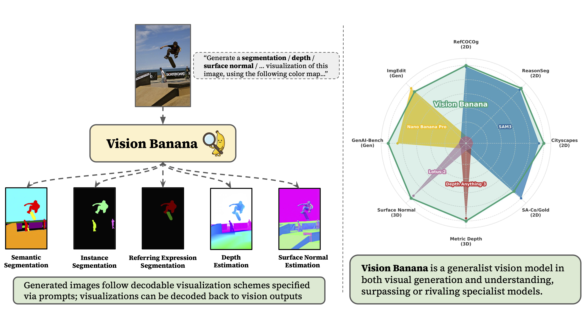
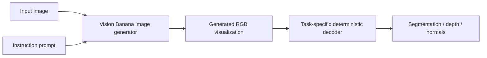
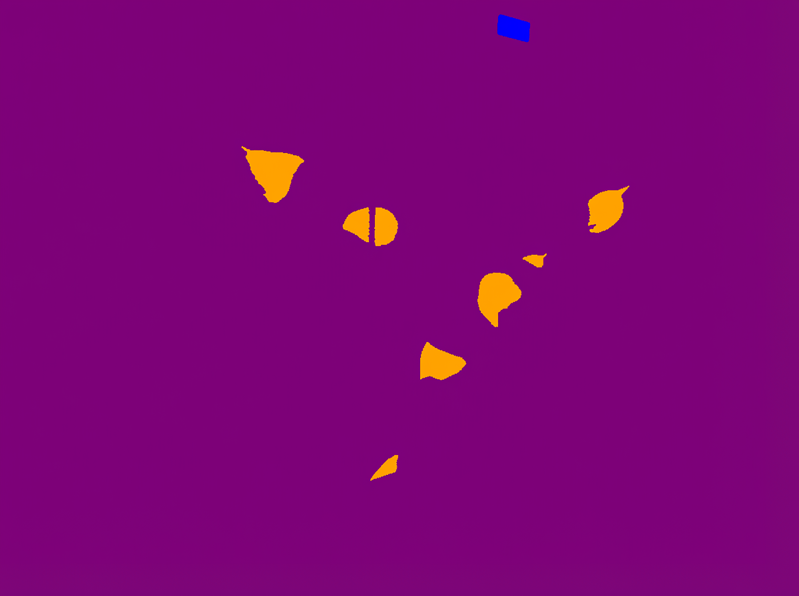
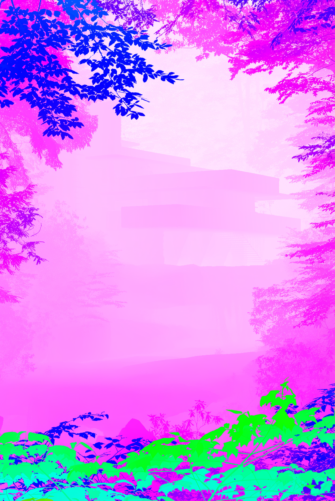
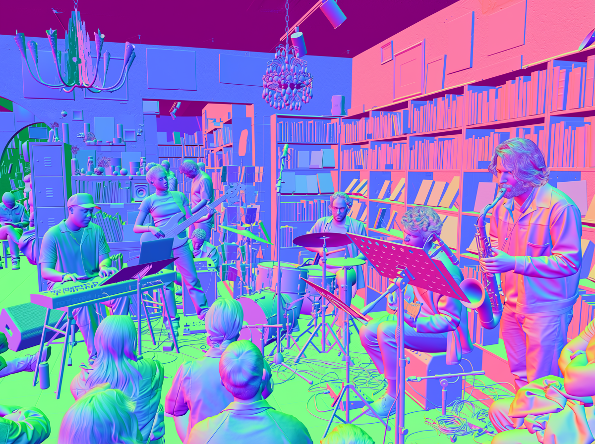

# Vision Banana Reading Notes

Paper: [Image Generators are Generalist Vision Learners](https://arxiv.org/abs/2604.20329)  
PDF: https://arxiv.org/pdf/2604.20329  
Project page: https://vision-banana.github.io/

Context: this paper is from Google / Google DeepMind. The main model is called **Vision Banana**. It is built by instruction-tuning **Nano Banana Pro** (NBP), an image generator, on a small amount of vision task data mixed into the original image-generation training mixture.

The big claim:

```text
Image generation pretraining may play for vision
the role that language-model pretraining plays for NLP.
```

## 0. The Goal

The paper asks:

```text
If a model can generate images well,
does it already understand images well?
```

To test this, the authors take a strong image generator and tune it to output **vision-task results as RGB images**.



The key shift:

```text
not:
    build one specialist head for depth
    another specialist head for segmentation
    another specialist head for normals

but:
    ask the image generator to generate an RGB visualization
    then decode that RGB visualization back into the task output
```

So the model remains an image generator. It just learns to generate special images whose colors encode segmentation masks, depth maps, surface normals, and so on.

## 1. Main Idea: Perception as Image Generation

Traditional vision tasks often look like:

```text
image
-> encoder / task-specific model
-> task-specific output head
```

Examples:

```text
semantic segmentation:
    image -> per-pixel class labels

depth estimation:
    image -> per-pixel metric depth values

surface normal estimation:
    image -> per-pixel 3D normal vectors
```

Vision Banana reframes all of these as:

```text
image + instruction prompt
-> generated RGB image
-> deterministic decoder
-> task output
```

In code-like form:

```python
rgb_visualization = image_generator(input_image, prompt)
task_output = decode_rgb_visualization(rgb_visualization, prompt)
```

The important design choice is that the generated RGB image must be **decodable**. It is not enough for it to look like a depth map or segmentation map. It must follow a precise color scheme so that benchmark metrics can be computed.

## 2. Why This Is Different From Ordinary Visualization

Many image generators can make things that visually resemble:

```text
segmentation maps
depth heatmaps
surface normal maps
```

But benchmark evaluation requires exact values:

```text
segmentation:
    each pixel needs a class / instance id

depth:
    each pixel needs a metric distance

normal:
    each pixel needs a unit vector
```

So Vision Banana uses prompts and color encodings that define an invertible interface:

```text
task output
-> RGB visualization
-> generated by model
-> decoded back to task output
```

This is the paper's central trick.

## 3. Training Recipe

The authors do **lightweight instruction-tuning** on Nano Banana Pro.

Training data mixture:

```text
mostly original Nano Banana Pro generation data
+ small amount of vision task data
```

Why keep the original generation data in the mixture?

```text
to avoid forgetting image generation
```

Why only a small amount of vision task data?

```text
because the hypothesis is:
    the generator already learned rich visual representations
    instruction tuning mainly teaches output formatting
```

The vision data covers:

```text
2D understanding:
    semantic segmentation
    instance segmentation
    referring expression segmentation

3D understanding:
    metric depth estimation
    surface normal estimation
```

Important experimental protocol:

```text
No training data from evaluation benchmarks is included.
```

This is why the paper calls the comparison **zero-shot transfer** for the evaluated benchmarks.

## 4. Unified RGB Output Interface

The model is always asked to generate an image. The difference between tasks is the prompt and decoding rule.



This resembles how LLMs use one output space:

```text
LLM:
    every task -> text output

Vision Banana:
    every vision task -> RGB image output
```

That is why the authors argue that image generation can be a **universal interface** for visual understanding.

## 5. Semantic Segmentation

Semantic segmentation assigns a class label to every pixel.

Vision Banana prompt format:

```text
Generate a semantic segmentation visualization image,
using this color mapping:
{"cat": "red", "lock": "pink", "exit sign": "light purple", "background": yellow}
```

or:

```text
The macaron cakes are represented by (255, 255, 0).
The round plates are represented by (255, 192, 128).
...
```



Decoding is simple:

```text
for each pixel:
    find the nearest requested color
    assign the corresponding class label
```

So the generated RGB image is a soft bridge between:

```text
natural-language prompt
and
pixelwise class map
```

Result highlighted by the paper:

| Dataset | Metric | Vision Banana | Strong zero-shot counterpart |
|---|---:|---:|---:|
| Cityscapes val | mIoU ↑ | 0.699 | SAM 3: 0.652 |

## 6. Instance Segmentation

Instance segmentation is harder because the number of instances is unknown.

Semantic segmentation:

```text
all dogs -> same dog color
```

Instance segmentation:

```text
dog 1 -> color A
dog 2 -> color B
dog 3 -> color C
```

Vision Banana handles this with a per-class inference strategy:

```text
Prompt:
    Generate an instance segmentation visualization of this image.
    Each basketball is colored differently.
```

Then evaluation clusters similarly colored pixels:

```text
generated RGB map
-> color clustering
-> instance masks
```

Result highlighted by the paper:

| Dataset | Metric | Vision Banana | Strong counterpart |
|---|---:|---:|---:|
| SA-Co/Gold | pmF1 ↑ | 0.540* | DINO-X: 0.552 |

The asterisk matters: the paper evaluates on a random subset of 500 SA-Co/Gold queries to save compute.

## 7. Referring Expression Segmentation

Referring segmentation asks:

```text
segment the object described by free-form language
```

Examples:

```text
the man in pink t shirt
the stretching cat
the game control device
the chef's names in both Chinese and English
```

This task requires more than category recognition. The model must understand:

```text
attributes
actions
relations
text in the image
multilingual cues
```

The paper reports:

| Dataset | Metric | Vision Banana | Strong zero-shot counterpart |
|---|---:|---:|---:|
| RefCOCOg UMD val | cIoU ↑ | 0.738 | SAM 3 Agent: 0.734 |
| ReasonSeg val | gIoU ↑ | 0.793 | SAM 3 Agent: 0.770 |

For ReasonSeg, methods are paired with multimodal LLMs for reasoning. The paper uses Gemini 2.5 Pro in the Vision Banana setup.

## 8. Metric Depth Estimation

Depth estimation predicts metric distance for each pixel:

```text
image pixel -> distance from camera plane in meters
```

Instead of adding a depth regression head, Vision Banana generates a false-color RGB depth image.



The challenge:

```text
metric depth d is unbounded:
    d in [0, infinity)

RGB is bounded:
    RGB in [0, 1]^3
```

The paper constructs a bijection:

```text
metric depth
-> curved normalized depth
-> RGB color along a path through the RGB cube
```

The normalized depth transform is:

$$
f(d,\lambda,c)
=
1-\left(1-\frac{d}{\lambda c}\right)^{\lambda+1}
$$

with:

$$
\lambda=-3,\quad c=\frac{10}{3}
$$

Intuition:

```text
near depth gets more color resolution
far depth gets compressed
```

This is useful because nearby objects are often more important, and many depth metrics are more sensitive to relative / inverse-depth errors.

At training time:

```text
ground-truth metric depth
-> RGB depth visualization target
```

At inference time:

```text
generated RGB depth visualization
-> inverse color mapping
-> metric depth map
```

Result highlighted by the paper:

| Benchmark group | Metric | Vision Banana | Strong specialist |
|---|---:|---:|---:|
| 6 depth benchmarks | average δ1 ↑ | 0.882 | UniK3D: 0.823 / MoGe-2: 0.802 |
| 4 datasets shared with Depth Anything V3 | average δ1 ↑ | 0.929 | Depth Anything V3: 0.918 |

Important claim:

```text
Vision Banana does not use camera intrinsics
in training or inference for predicting depth.
```

The paper trains depth using synthetic depth data from simulation engines and zero real-world depth data from the evaluated benchmarks.

## 9. Surface Normal Estimation

Surface normals are 3D unit vectors:

$$
\mathbf{n}=(x,y,z),\quad x,y,z\in[-1,1]
$$

Unlike metric depth, normal vectors already fit RGB-style encoding naturally.

Camera-space convention in the paper:

```text
+x -> right
+y -> up
+z -> out of the image plane / toward camera
```

The typical encoding is:

$$
\mathrm{RGB}
=
\frac{\mathbf{n}+1}{2}
$$

or equivalently:

```text
normal component -1 -> RGB value 0
normal component  0 -> RGB value 0.5
normal component +1 -> RGB value 1
```



Result highlighted by the paper:

| Benchmark group | Metric | Vision Banana | Strong counterpart |
|---|---:|---:|---:|
| 3 indoor normal benchmarks | mean angular error ↓ | 15.549 | Lotus-2: 16.558 |

The paper says Vision Banana is competitive outdoors too, but its strongest quantitative advantage is on indoor normal estimation.

## 10. Generation Capability Is Preserved

A worry:

```text
If we tune an image generator on segmentation/depth/normal outputs,
will it forget how to generate normal images?
```

The paper checks this by comparing Vision Banana against Nano Banana Pro:

| Task | Benchmark | Vision Banana win rate vs NBP |
|---|---|---:|
| Text-to-image | GenAI-Bench | 53.5% |
| Image editing | ImgEdit | 47.8% |

Interpretation:

```text
Vision Banana remains roughly on par with Nano Banana Pro
for visual generation and editing.
```

This supports the instruction-tuning story:

```text
the model did not become only a perception model;
it remains a generator.
```

## 11. How This Relates to Transfusion

Transfusion asks:

```text
Can one model use text LM loss and image diffusion loss
to generate both text and images?
```

Vision Banana asks:

```text
Can one image generator do both image generation
and visual understanding if all vision outputs are represented as images?
```

Connection:

```text
Transfusion:
    unify modalities inside one sequence model

Vision Banana:
    unify vision tasks inside one RGB generation interface
```

A useful comparison:

| Paper | Unification target | Main trick |
|---|---|---|
| Transfusion | text + images | separate LM and diffusion losses in one transformer |
| Vision Banana | generation + perception | encode all vision outputs as RGB images |

Both papers are pushing against task-specific heads:

```text
not:
    one architecture / head / loss per task

but:
    one generative interface with task instructions
```

## 12. Why The Result Is Interesting

The usual story in computer vision:

```text
understanding models:
    trained with classification / contrastive / dense prediction losses

generation models:
    trained to synthesize pixels
```

This paper argues the boundary may be weaker than expected:

```text
to generate realistic images,
the model must internalize object identity, geometry, layout, lighting, scale, and semantics
```

Instruction tuning then reveals those internal representations by teaching:

```text
how to express depth as RGB
how to express masks as RGB
how to express normals as RGB
```

So the paper's strongest conceptual claim is:

<span style="color:red">Image generators may already be visual foundation models; they just need the right output language.</span>

## 13. Limitations and Open Questions

- Compute is likely much higher than specialist perception models.
- RGB output decoding can introduce artifacts or sensitivity to color errors.
- Some tasks require carefully designed invertible color maps.
- Instance segmentation remains harder because the number of objects is unknown.
- The base model, Nano Banana Pro, is not fully described in the paper, so architecture-level details are limited.
- Results depend on strong proprietary model pretraining, making reproduction difficult.
- The paper focuses on several dense prediction tasks; broader task diversity remains future work.

## 14. One-Sentence Summary

Vision Banana shows that a strong image generator can be instruction-tuned into a generalist vision model by making perception tasks look like image generation: generate RGB visualizations that can be decoded back into segmentation masks, metric depth maps, surface normals, and other vision outputs.

## References

- Paper arXiv: https://arxiv.org/abs/2604.20329
- Paper PDF: https://arxiv.org/pdf/2604.20329
- Project page: https://vision-banana.github.io/
