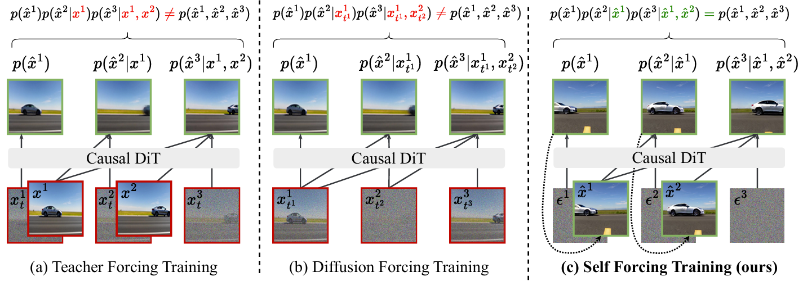
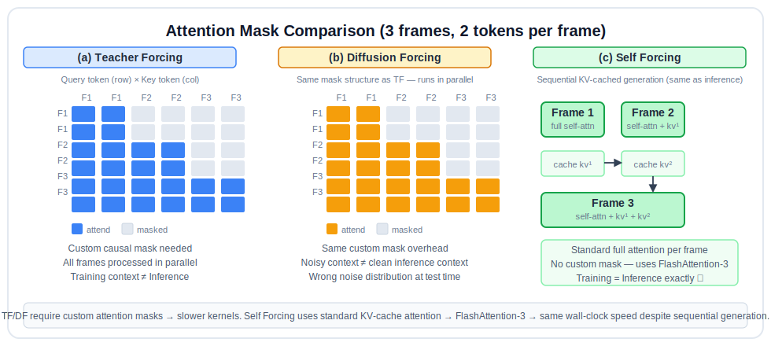
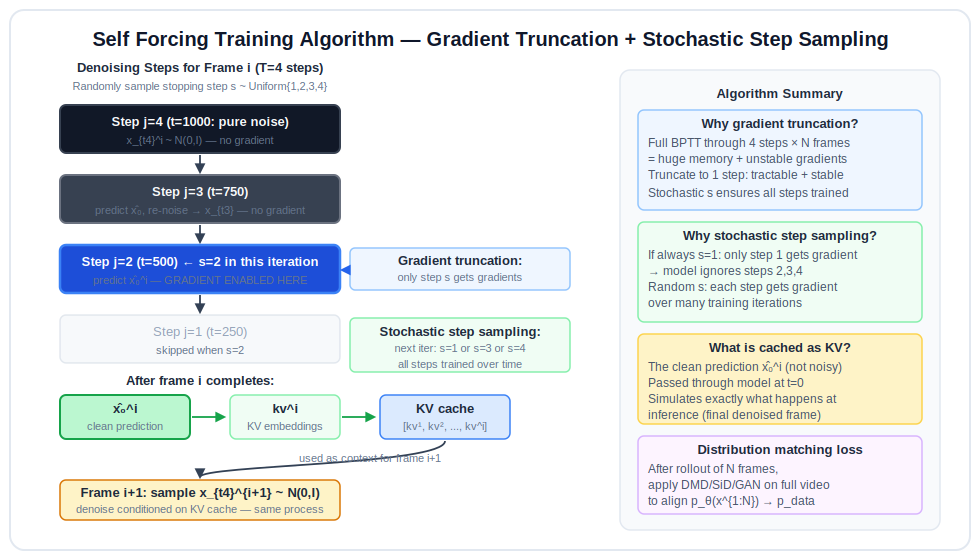
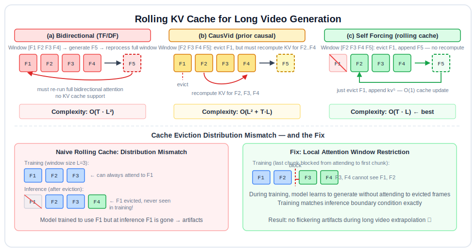

# Self Forcing Reading Notes

Paper: [Self Forcing: Bridging the Train-Test Gap in Autoregressive Video Diffusion](https://arxiv.org/abs/2506.08009)  
Authors: Xun Huang, Zhengqi Li, Guande He, Mingyuan Zhou, Eli Shechtman (Adobe Research)

---

## 0. The Core Problem: Exposure Bias

Autoregressive video generation models face a fundamental mismatch between training and inference.

<!--  -->


**During training (Teacher Forcing):** the model sees ground-truth context frames.

**During inference:** the model must generate the next frame conditioned on its *own previously generated frames*, which are imperfect.

This is called **exposure bias**. Small per-frame errors compound over time, degrading long video quality.

```text
Training:     x^1_GT  →  x^2_GT  →  x^3_GT  →  ...
Inference:    x^1_θ   →  x^2_θ   →  x^3_θ   →  ...
                (each x^i_θ contains error from previous steps)
```

The longer the video, the worse the drift.

---

## 1. Autoregressive Video Diffusion: Background

### 1.1 Autoregressive Factorization

A video $x^{1:N}$ of $N$ frames is modeled as:

$$
p(x^{1:N}) = \prod_{i=1}^{N} p(x^i \mid x^{<i})
$$

Each frame is generated conditioned on all preceding frames. This enables streaming (frame by frame) and long video generation via sliding windows.

### 1.2 Diffusion Process

Within each frame generation, a **flow matching / diffusion process** is used.

**Forward process** (adding noise):

$$
x_t^i = \frac{t'}{1000} \cdot x^i + \left(1 - \frac{t'}{1000}\right) \cdot \varepsilon^i, \quad \varepsilon^i \sim \mathcal{N}(0, I)
$$

where $t'$ is a shifted timestep (see §4 for the shifting formula).

**Reverse process** (denoising): the model $G_\theta$ predicts the clean frame $\hat{x}_0^i$ from a noisy observation $x_t^i$:

$$
G_\theta: (x_t^i, t, \text{KV context}) \rightarrow \hat{x}_0^i
$$

The **denoising loss** trains the model to reconstruct the clean frame:

$$
\mathcal{L}^{DM}_\theta = \mathbb{E}_{x^i, t^i, \varepsilon^i} \left[ w_t \left\| \hat{\varepsilon}^i_\theta - \varepsilon^i \right\|_2^2 \right]
$$

### 1.3 KV Caching for Autoregressive Inference

The transformer conditions on previous frames via **Key-Value (KV) attention**. Each generated frame's KV embeddings are cached and reused when generating later frames:

```text
Generate frame 1:  KV_cache = []               → x^1_θ, cache kv^1
Generate frame 2:  KV_cache = [kv^1]           → x^2_θ, cache kv^2
Generate frame 3:  KV_cache = [kv^1, kv^2]    → x^3_θ, cache kv^3
...
```

This mirrors how language model KV caching works.

---

## 2. Three Training Paradigms

The paper's Figure 1 directly compares the three paradigms:

| Paradigm | Context frames at training | Problem |
|---|---|---|
| Teacher Forcing (TF) | Ground-truth clean frames | Context never seen at inference |
| Diffusion Forcing (DF) | Independently noised frames | Noise level ≠ inference distribution |
| **Self Forcing** | Model's own generated frames | **Matches inference exactly** |

### 2.1 Teacher Forcing

Train on full clean ground-truth context:

$$
\mathcal{L}_{TF} = \mathbb{E} \left[ \left\| G_\theta(x_{t}^i; t, \{x^{<i}_{GT}\}) - x^i \right\|^2 \right]
$$

The model never sees imperfect generated frames, so at inference time it encounters out-of-distribution context.

### 2.2 Diffusion Forcing

Each context frame is independently noised to a random timestep $t_j$:

$$
x_{t_j}^j = \alpha_{t_j} x^j + \sigma_{t_j} \varepsilon^j
$$

During inference, the denoising trajectory goes $t_T \to t_{T-1} \to \cdots \to 0$, so the distribution of context frames *still does not match* the training distribution (which used independent random noise levels).

**CausVid's flaw:** CausVid applies DMD loss to DF-generated outputs, but those outputs come from the DF distribution rather than the inference distribution. The distribution being matched is wrong.

### 2.3 Self Forcing (This Paper)

During training, generate frames autoregressively using the model's own predictions — exactly replicating inference. Then apply a video-level distribution matching loss.

```text
Self Forcing training step:
  1. rollout: generate x^1_θ, x^2_θ, ..., x^N_θ using the model
  2. match: minimize divergence between {x^1_θ,...,x^N_θ} and p_data
```

---

## 3. Attention Mask Comparison



Figure 2 in the paper shows the attention masks for a 3-frame video (2 tokens per frame):

**Teacher Forcing / Diffusion Forcing:** train the full video in parallel using custom causal attention masks. Frame $i$ can attend to all earlier frames:

```text
Frame 1 tokens: attend to frame 1 only
Frame 2 tokens: attend to frames 1-2
Frame 3 tokens: attend to frames 1-3
```

This requires *custom attention masks* that differ from standard inference attention.

**Self Forcing:** training mirrors inference exactly — uses standard full attention with KV caching, no special masks needed:

```text
Generate frame 1: full self-attention on frame 1
Generate frame 2: full self-attention on frame 2, cross-attention to KV cache of frame 1
Generate frame 3: full self-attention on frame 3, cross-attention to KV cache of frames 1-2
```

This alignment means the training computation graph is identical to inference, removing the train-test gap structurally.

---

## 4. Self Forcing Training Algorithm



### 4.1 Overview

The key challenges are:

1. **Efficiency:** autoregressive rollout is sequential, but gradients must flow back through many denoising steps.
2. **Credit assignment:** which step's prediction should receive gradient signal?

Self Forcing solves both with **gradient truncation** + **stochastic step sampling**.

### 4.2 Denoising Schedule and Timestep Shifting

The model uses a 4-step schedule: $\{t_1, t_2, t_3, t_4\} = \{1000, 750, 500, 250\}$.

To concentrate the signal-to-noise ratio, a **timestep shifting** formula is applied:

$$
t'(k, t) = \frac{k \cdot (t/1000)}{1 + (k-1)(t/1000)} \cdot 1000, \quad k = 5
$$

This shifts the schedule so that more denoising capacity is allocated to high-noise steps.

The **data prediction model** in flow matching form:

$$
G_\theta(x, t, c) = c_{\text{skip}} \cdot \varepsilon - c_{\text{out}} \cdot v_\theta(c_{\text{in}} \cdot x_t,\, c_{\text{noise}}(t'),\, c)
$$

where $v_\theta$ is the learned velocity field and $c_{\text{skip}}, c_{\text{out}}, c_{\text{in}}$ are scaling factors.

### 4.3 Algorithm

$$
\textbf{Algorithm 1: Self Forcing Training}
$$

```
Input: Denoise timesteps {t_1, ..., t_T}, Frame count N, Model G_θ

for each training iteration:

    Initialize output buffer X_θ = []
    Initialize KV cache KV = []
    Sample stopping step  s ~ Uniform{1, 2, ..., T}

    for i = 1 to N:                         # sequential over frames
        Sample x_{t_T}^i ~ N(0, I)          # start from pure noise

        for j = T downto s:                  # denoising loop

            if j == s:                        # ← ONLY step that gets gradient
                ENABLE gradients
                x̂_0^i = G_θ(x_{t_j}^i; t_j, KV)
                X_θ.append(x̂_0^i)
                DISABLE gradients
                kv^i = G_θ^KV(x̂_0^i; t=0, KV)  # cache clean frame's KV
                KV.append(kv^i)

            else:
                DISABLE gradients
                x̂_0^i = G_θ(x_{t_j}^i; t_j, KV)
                ε ~ N(0, I)
                x_{t_{j-1}}^i = Ψ(x̂_0^i, ε, t_{j-1})  # re-noise for next step

    L = distribution_matching_loss(X_θ)     # holistic video-level loss
    Update θ via ∇_θ L
```

**Gradient truncation** means only the final denoising step (step $s$) backpropagates through the model. This is critical: BPTT through the full 4-step denoising chain for $N$ frames would be prohibitively expensive and numerically unstable.

**Stochastic step sampling** ($s \sim \text{Uniform}$): different training iterations supervise different denoising steps. Over many iterations, all steps receive gradient signal.

The result: the generated $\hat{x}_0^i$ at step $s$ is cached as clean context for the next frame. The model learns to generate frames that serve as good context for subsequent generation — just as at inference.

---

## 5. Distribution Matching Losses

Unlike standard reconstruction loss (which compares to ground truth frame-by-frame), Self Forcing uses **video-level distribution matching**: align $p_\theta(x^{1:N})$ with $p_{\text{data}}(x^{1:N})$ where context frames come from the model's own distribution.

The paper experiments with three variants.

### 5.1 Distribution Matching Distillation (DMD)

Minimizes the reverse KL divergence between generated and real distributions at each noise level:

$$
\nabla_\theta \mathbb{E}_t \left[ D_{KL}(p_{\theta,t} \| p_{\text{data},t}) \right] = -\mathbb{E}_{t, \hat{x}_t, \hat{x}} \left[ \left( s_{\text{real}}(\hat{x}_t, t) - s_{\text{fake}}(\hat{x}_t, t) \right) \frac{\partial \hat{x}}{\partial \theta} \right]
$$

Implemented as a regression loss to avoid explicit score computation:

$$
\mathcal{L}_{\text{DMD}}(\theta) = \mathbb{E}_{t, \hat{x}_t, \hat{x}} \left[ \frac{1}{2} \left\| \hat{x} - \text{sg}\left[\hat{x} - \left(f_\psi(\hat{x}_t, t) - f_\phi(\hat{x}_t, t)\right)\right] \right\|^2 \right]
$$

where:
- $f_\psi$ is a **real score network** (frozen teacher pretrained on real data)
- $f_\phi$ is a **fake score network** (trained on generated samples)
- $\text{sg}[\cdot]$ is stop-gradient
- The difference $f_\psi - f_\phi$ is the gradient direction to push generated samples toward the real distribution

```python
# DMD loss intuition
score_diff = score_real(x_noisy, t) - score_fake(x_noisy, t)
target = stop_gradient(x_generated - score_diff)
loss_dmd = 0.5 * mse(x_generated, target)
```

### 5.2 Score Identity Distillation (SiD)

Matches distributions via Fisher divergence on score functions:

$$
\mathcal{L}_{\text{SiD}}(\theta) = \mathbb{E}_{t, \hat{x}_t, \hat{x}} \left[ (f_\phi(\hat{x}_t,t) - f_\psi(\hat{x}_t,t))^\top (f_\psi(\hat{x}_t,t) - \hat{x}) + (1-\alpha)\|f_\phi(\hat{x}_t,t) - f_\psi(\hat{x}_t,t)\|^2 \right]
$$

where $\alpha$ controls the balance between direction and magnitude matching.

### 5.3 GAN Loss

The adversarial variant trains a discriminator $f_\psi$ to distinguish real from generated frames:

$$
\mathcal{L}_D(\psi) = -\mathbb{E}\left[\log\left(\text{sigmoid}\left(f_\psi(x_t) - f_\psi(\hat{x}_t)\right)\right)\right] + \lambda \mathcal{L}_{\text{reg}}
$$

$$
\mathcal{L}_G(\theta) = -\mathbb{E}\left[\log\left(\text{sigmoid}\left(f_\psi(\hat{x}_t) - f_\psi(x_t)\right)\right)\right]
$$

This is a **relativistic GAN** formulation: the discriminator outputs a relative preference between real and fake rather than an absolute real/fake score.

### 5.4 Why Holistic Video-Level Matching Matters

Frame-level distribution matching optimizes:

$$
D(p_{\text{data}}(x^i \mid x^{<i}_{\text{GT}}) \| p_\theta(x^i \mid x^{<i}_{\text{GT}}))
$$

Self Forcing optimizes:

$$
D(p_{\text{data}}(x^{1:N}) \| p_\theta(x^{1:N}))
$$

where context frames $x^{<i}$ in both distributions come from the **model's own distribution** $p_\theta$. This is the key difference: the model is trained to match the joint video distribution, not marginal per-frame distributions conditioned on ground truth.

---

## 6. Rolling KV Cache for Long Videos

Generating arbitrarily long videos requires bounded-memory inference.

 The paper introduces a **rolling KV cache** of fixed size $L$ frames.

### 6.1 Complexity Analysis

Figure 3 in the paper compares three approaches:

| Method | KV cache behavior | Complexity | Notes |
|---|---|---|---|
| Bidirectional (TF/DF) | No KV cache support | $O(TL^2)$ | Must reprocess full window |
| Prior causal (CausVid) | Cache exists but re-computed on window shift | $O(L^2 + TL)$ | Recomputes when sliding |
| **Self Forcing** | Rolling cache, no recomputation | $O(TL)$ | Evict oldest, append newest |

$$
\textbf{Algorithm 2: Autoregressive Inference with Rolling KV Cache}
$$

```
Input: Cache size L, Timesteps {t_1,...,t_T}, Frame count M, Model G_θ

Initialize X_θ = [],  KV = []

for i = 1 to M:
    Sample x_{t_T}^i ~ N(0, I)

    for j = T downto 1:
        x̂_0^i = G_θ(x_{t_j}^i; t_j, KV)

        if j == 1:                       # final denoising step
            X_θ.append(x̂_0^i)
            kv^i = G_θ^KV(x̂_0^i; t=0, KV)

            if |KV| == L:
                KV.pop(0)               # evict oldest frame's KV

            KV.append(kv^i)             # append new frame's KV

        else:
            ε ~ N(0, I)
            x_{t_{j-1}}^i = Ψ(x̂_0^i, ε, t_{j-1})

return X_θ
```

### 6.2 The Cache Eviction Problem

A naive rolling cache causes a **distribution mismatch** at inference:

- During training with window size $L$: the model always attends to frames $\{1, ..., L\}$.
- During inference with rolling cache: after eviction, the model attends to frames $\{i-L+1, ..., i\}$.

When the cache transitions from $[1..L]$ to $[2..L+1]$, the model suddenly cannot attend to frame 1 — but it was never trained for this situation.

**Solution:** Train with a **local attention window restriction** — during training of the last chunk, prevent the model from attending to the first chunk. This simulates the cache eviction boundary at training time.

Figure 7 in the paper shows that without this fix, extrapolated frames develop severe flickering artifacts; with the fix, generation is smooth and consistent.

---

## 7. Training Efficiency

A counterintuitive result: despite being *sequential* (frame by frame), Self Forcing training is **as fast as parallel Teacher/Diffusion Forcing**.

### Why?

| Factor | TF/DF (parallel) | Self Forcing (sequential) |
|---|---|---|
| Attention type | Custom causal masks | Standard full attention + KV cache |
| Kernel | Slow masked attention | FlashAttention-3 (highly optimized) |
| Memory access | Irregular (masked) | Sequential (KV cache friendly) |

The standard FlashAttention-3 kernel is far more optimized than custom masked attention. The sequential overhead is offset by faster per-step computation.

Figure 6 in the paper shows:

- **Per-iteration time:** Self Forcing ≈ TF ≈ DF (all comparable)
- **Quality vs. wall-clock time:** Self Forcing reaches higher VBench scores at the same training time budget

```text
Same training budget:
    TF only   → good image quality, bad error accumulation
    DF only   → noisy training signal, degrades under AR generation  
    Self Forcing → best of both: matches training to inference distribution
```

---

## 8. Architecture Details

- **Base model:** Wan2.1-T2V-1.3B (Flow Matching-based Diffusion Transformer)
- **Latent space:** Causal 3D VAE compression
- **Resolution:** 832 × 480 at 16 FPS (5-second clips = 80 frames)
- **Denoising steps:** 4 steps, schedule $\{1000, 750, 500, 250\}$
- **Attention:** Causal transformer, FlashAttention-3

**Training configuration:**

| Hyperparameter | Value |
|---|---|
| GPUs | 64 × H100 80GB |
| Batch size | 64 (DMD/SiD), 768 (GAN) |
| Optimizer | AdamW, $\beta_1=0$, $\beta_2=0.999$ |
| Generator LR | $2 \times 10^{-6}$ |
| Critic LR | $4 \times 10^{-7}$ to $2 \times 10^{-6}$ |
| Convergence | ~1.5h (DMD), 2-3h (SiD/GAN) |

---

## 9. Experimental Results

### 9.1 VBench Scores (Table 1)

VBench measures 16 dimensions of video quality. Scores are reported as Total / Quality / Semantic:

| Method | Total | Quality | Semantic | FPS | Latency |
|---|---|---|---|---|---|
| Wan2.1 (baseline) | 84.26 | 85.07 | 80.73 | 0.78 | 103.4s |
| CausVid | 83.22 | 84.52 | 78.33 | 12.3 | 0.65s |
| **Self Forcing (chunk)** | **84.31** | **85.07** | **81.28** | **17.0** | **0.69s** |
| Self Forcing (frame) | 84.26 | 85.07 | 80.73 | 8.9 | 0.45s |

Key takeaway: Self Forcing achieves **150× lower latency** than Wan2.1 while matching its VBench score.

### 9.2 Ablation Study (Table 2)

The ablation isolates the contribution of Self Forcing vs. using TF or DF context:

| Training | Chunk VBench | Frame VBench |
|---|---|---|
| DF only | 82.95 | 77.24 |
| TF only | 83.58 | 80.34 |
| DF + DMD | 82.76 | 80.56 |
| TF + DMD | 82.32 | 78.12 |
| **Self Forcing + DMD** | **84.31** | **84.26** |
| Self Forcing + SiD | 84.07 | 83.54 |
| Self Forcing + GAN | 83.88 | 83.27 |

The frame-wise setting is the hardest test of error accumulation (every frame is generated independently). DF-only degrades catastrophically (77.24), while Self Forcing maintains quality (84.26). This directly validates the exposure bias hypothesis.

### 9.3 User Study

1003 prompts from MovieGenBench evaluated by human raters. Self Forcing is preferred over:

- Wan2.1 (2× slower by latency)
- SkyReels-V2
- CausVid
- NOVA
- Pyramid Flow

---

## 10. The CausVid Flaw Explained

CausVid (the most directly related prior work) uses:

1. Diffusion Forcing (noisy context frames) during training.
2. DMD loss to match generated frames to real data distribution.

The flaw: at inference, context frames are **clean generated frames** (fully denoised). At training, context frames are **noisy independently-sampled frames** (DF). These are different distributions.

```text
CausVid inference distribution:  p_θ(x^i | x^{<i}_clean_generated)
CausVid training distribution:   p_θ(x^i | x^{<i}_noisy_independent)
```

The DMD loss is minimizing divergence from real data, but starting from the wrong distribution. It is matching $p_\theta^{\text{train}}$ to $p_{\text{data}}$, not $p_\theta^{\text{inference}}$ to $p_{\text{data}}$.

Self Forcing fixes this: the training rollout exactly replicates inference, so the distribution being matched is the actual inference distribution.

---

## 11. Core Formula Set

**Autoregressive factorization:**

$$
p(x^{1:N}) = \prod_{i=1}^{N} p(x^i \mid x^{<i})
$$

**Forward (noising) process:**

$$
x_t = \frac{t'}{1000} x + \left(1 - \frac{t'}{1000}\right) \varepsilon, \quad \varepsilon \sim \mathcal{N}(0, I)
$$

**Timestep shifting:**

$$
t'(k, t) = \frac{k \cdot (t/1000)}{1 + (k-1)(t/1000)} \cdot 1000, \quad k = 5
$$

**DMD loss:**

$$
\mathcal{L}_{\text{DMD}}(\theta) = \mathbb{E} \left[ \frac{1}{2} \left\| \hat{x} - \text{sg}\left[\hat{x} - (f_\psi(\hat{x}_t, t) - f_\phi(\hat{x}_t, t))\right] \right\|^2 \right]
$$

**GAN generator loss:**

$$
\mathcal{L}_G(\theta) = -\mathbb{E}\left[\log\sigma\left(f_\psi(\hat{x}_t) - f_\psi(x_t)\right)\right]
$$

---

## 12. Knowledge Map

Prerequisites:

```text
sequence modeling (autoregressive models)
→ diffusion models
→ flow matching
→ video generation
→ exposure bias / teacher forcing in seq2seq
→ distribution matching distillation (DMD)
→ KV caching in transformers
→ Self Forcing
```

Before Self Forcing:

- **Teacher Forcing** (classic seq2seq training): ground-truth context.
- **Scheduled Sampling**: randomly mix GT and generated context during training — but not designed for diffusion.
- **Diffusion Forcing** (Chen et al.): noisy context with independent noise levels.
- **CausVid** (Yin et al.): DF + DMD loss, but distribution mismatch in DMD target.

After / Related:

- **MAGI:** few-step autoregressive generation, different efficiency focus.
- **SkyReels-V2:** bidirectional diffusion, no KV cache support.
- **Pyramid Flow:** rolling noise schedules, high latency.

---

## 13. Main Contributions

Three linked ideas:

1. **Self Forcing training:** expose the model to its own generated frames during training, exactly replicating inference, eliminating exposure bias structurally.
2. **Gradient truncation + stochastic step sampling:** makes sequential training tractable — only the final denoising step receives gradients, while all steps receive supervision across iterations.
3. **Rolling KV cache + local attention training:** enables bounded-memory long video generation with $O(TL)$ complexity, with a training-time fix for the cache eviction distribution mismatch.

---

## 14. Limitations and Open Questions

- The training is sequential over frames — inherently harder to parallelize than TF/DF.
- The rolling KV cache has a fixed temporal horizon; very long-range dependencies are lost.
- The distribution matching losses require separate score networks ($f_\psi, f_\phi$), adding model complexity.
- Quality still slightly trails fully bidirectional models (Wan2.1) on some semantic metrics.
- The method is validated on one base architecture (Wan2.1-T2V-1.3B); generalization to other architectures is not shown.

---

## 15. One-Sentence Summary

```text
Self Forcing trains autoregressive video diffusion models by rolling out 
the model's own predictions as context during training, applying gradient 
truncation for efficiency and video-level distribution matching for quality, 
directly eliminating the train-test exposure bias that causes error accumulation.
```

Compact mental model:

```text
At training time:
    generate frames autoregressively, just like inference
    only the last denoising step gets gradients
    match the joint video distribution to real data

At inference time:
    same KV-cached autoregressive generation
    no distribution shift — training and inference are identical
```

---

## References

- Self Forcing arXiv: https://arxiv.org/abs/2506.08009
- Wan2.1 (base model): https://arxiv.org/abs/2503.20314
- CausVid: https://arxiv.org/abs/2412.07772
- Diffusion Forcing: https://arxiv.org/abs/2407.01392
- DMD (Distribution Matching Distillation): https://arxiv.org/abs/2311.18828
- SiD (Score Identity Distillation): https://arxiv.org/abs/2404.04057
