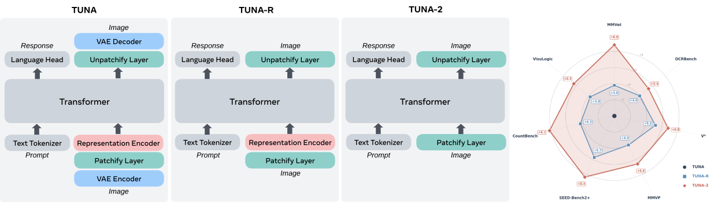
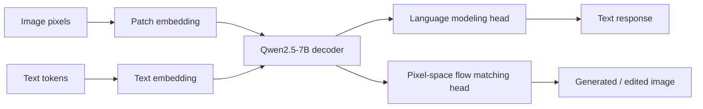
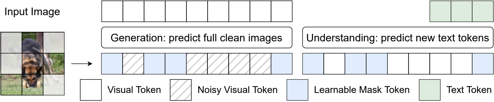
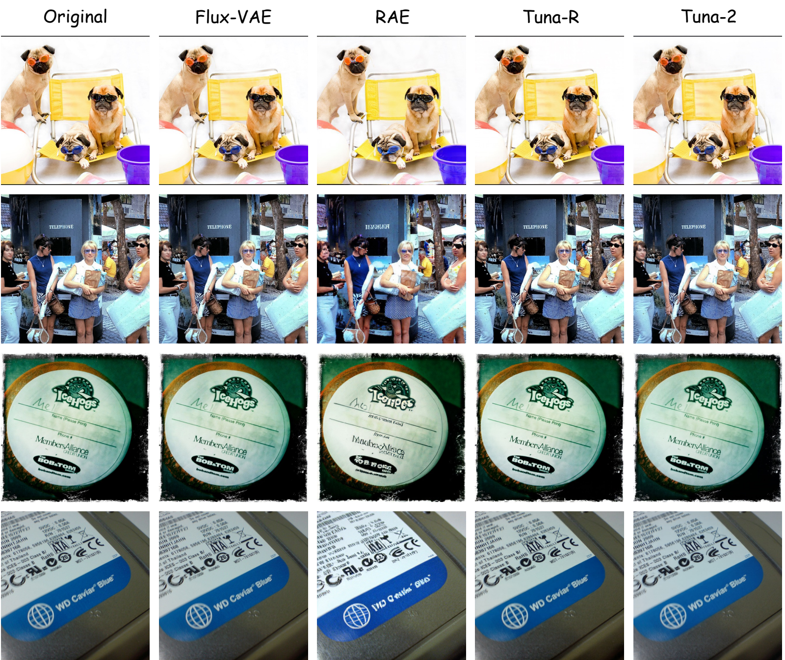
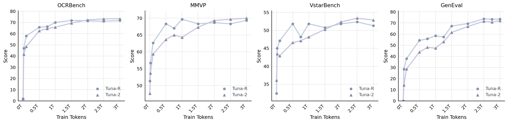
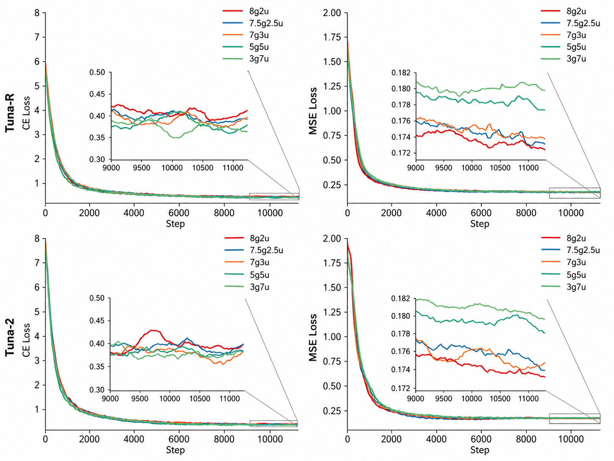
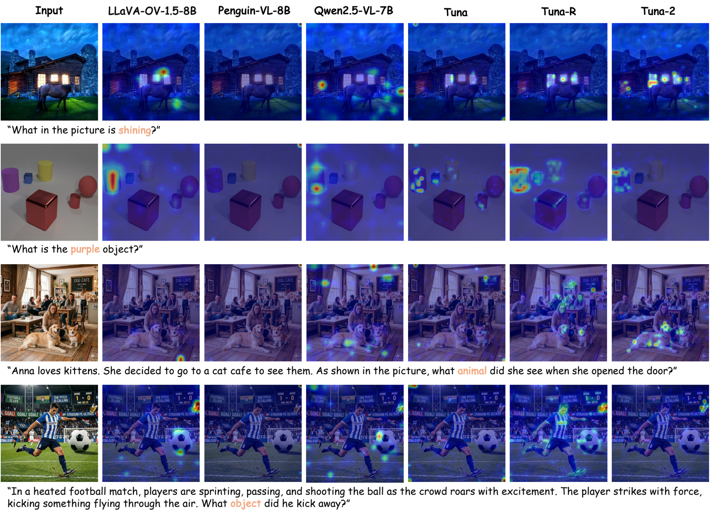

# Tuna-2 Reading Notes

Paper: [Tuna-2: Pixel Embeddings Beat Vision Encoders for Multimodal Understanding and Generation](https://arxiv.org/abs/2604.24763)  
PDF: [arXiv PDF](https://arxiv.org/pdf/2604.24763)  
Project: [tuna-ai.org/tuna-2](https://tuna-ai.org/tuna-2)

Submitted: 2026-04-27  
Authors: Zhiheng Liu, Weiming Ren, Xiaoke Huang, Shoufa Chen, Tianhong Li, Mengzhao Chen, Yatai Ji, Sen He, Jonas Schult, Belinda Zeng, Tao Xiang, Wenhu Chen, Ping Luo, Luke Zettlemoyer, Yuren Cong

---

## 0. One Sentence

Tuna-2 asks whether unified multimodal models still need pretrained vision encoders, and answers: for a 7B native understanding-generation model, direct pixel patch embeddings can beat encoder-based visual representations on understanding while staying competitive on generation.

```text
old unified multimodal recipe:
    image -> pretrained vision encoder / VAE -> visual tokens -> LLM

Tuna-2 recipe:
    image pixels -> patch embedding -> LLM decoder -> text head / flow matching head
```

The provocative claim is:

```text
pretrained vision encoders are useful early in training,
but not necessary at scale for unified multimodal modeling.
```

## 1. Why This Paper Exists

Unified multimodal models want one model to support:

```text
image -> text                  visual understanding
text -> image                  image generation
image + instruction -> image   image editing
```

Earlier systems often split visual representations:

| Use case | Common representation | Problem |
|---|---|---|
| Understanding | CLIP / SigLIP-style semantic encoder | good semantics, may lose low-level detail |
| Generation | VAE / VQ-VAE / latent tokenizer | compact, but introduces reconstruction bottleneck |

The paper argues that even "unified representation" models often still depend on pretrained encoders. That creates two limitations:

1. The vision module brings fixed inductive biases, such as fixed input resolution and semantic pretraining priorities.
2. The whole system is not fully end-to-end from raw pixels.

Tuna-2 pushes the simplification further:

```text
Can we remove both:
    1. the VAE used for image generation,
    2. the representation encoder used for image understanding?
```

## 2. Model Variants



Figure 1 is the shortest version of the whole paper: start from Tuna, remove the VAE to get Tuna-R, then remove the representation encoder to get Tuna-2.

The paper compares three closely related designs.

| Name | VAE? | Representation encoder? | Image input to LLM |
|---|---:|---:|---|
| Tuna | yes | yes / encoder-based visual stack | latent / encoded visual tokens |
| Tuna-R | no | yes, SigLIP 2 So400M | pixel-space tokens from representation encoder |
| Tuna-2 | no | no | raw image patch embeddings |

The important controlled comparison is:

```text
Tuna-R:
    pixels -> SigLIP 2 representation encoder -> connector -> Qwen2.5-7B decoder

Tuna-2:
    pixels -> simple patch embedding -> Qwen2.5-7B decoder
```

So Tuna-R is the "keep the semantic vision encoder" baseline, while Tuna-2 is the encoder-free model.



The main shift is:

```text
not:
    image -> pretrained visual representation -> LLM

but:
    image pixels -> patch embedding -> LLM
```

## 3. Pixel-Space Image Generation

Removing the VAE means they cannot use the usual latent diffusion setup. Instead, Tuna-2 performs flow matching directly in pixel space.

Given clean image $x_1$, Gaussian noise $x_0$, and timestep $t$:

$$
x_t = t x_1 + (1-t)x_0,\quad t \in [0,1]
$$

The model predicts the clean image:

$$
x_\theta = \pi_\theta(x_t, c, t)
$$

where $c$ is the condition:

```text
text-to-image: c = text prompt
image editing: c = text instruction + input image
```

Although the network predicts $x_\theta$, the loss is applied after converting that prediction into velocity:

$$
v_\theta = \frac{x_\theta - x_t}{1-t}
$$

and regressing toward:

$$
v = x_1 - x_0
$$

Training objective:

$$
\mathcal{L}_{flow} = \mathbb{E}\left[ \|v_\theta - v\|_2^2 \right]
$$

During inference, they use an Euler solver:

$$
x_{t'} = x_t + (t' - t)v_\theta
$$

## 4. Masking-Based Feature Learning



Pixel space is high-dimensional and redundant. The authors worry that without a compact latent bottleneck, the model may learn shallow shortcuts instead of robust visual features.

Their fix is masked visual feature learning:

```text
randomly choose image patches
replace them with a learnable mask token
feed masked visual sequence into the LLM decoder
```

The same masking operation is used differently depending on the task:

| Task | What masking does |
|---|---|
| Generation | model predicts clean image patches in both masked and unmasked regions |
| Understanding | model answers text questions from partially observed visual input |

Interpretation:

```text
for generation:
    masking makes denoising harder and teaches the mask token useful reconstruction behavior

for understanding:
    masking regularizes visual reasoning under missing evidence
```

In ablations with a smaller Qwen2.5-1.5B backbone, masking helps both Tuna-R and Tuna-2. Tuna-2 benefits more, probably because Tuna-R's SigLIP 2 encoder already has masked-prediction-style pretraining.

The useful way to read this figure:

```text
generation examples:
    masked noisy image + condition
    -> predict the clean image everywhere

understanding examples:
    masked image + question
    -> predict the answer text
```

So masking is both a harder denoising objective and a visual reasoning regularizer.

## 5. Training Setup

Backbone:

```text
Qwen2.5-7B-Instruct decoder
```

Stage 1 pretraining:

```text
550M in-house image-text pairs
70% image captioning / understanding
30% text-to-image generation
plus text-only Nemotron data, 20% of total pretraining data
300k steps
64 nodes
AdamW, lr = 1e-4
sequence length padded to 16k tokens per GPU
```

Stage 2 SFT:

```text
13M FineVision conversational examples
about 2M OmniEdit examples
high-quality image generation data
50k steps
AdamW, lr = 2e-5
```

Extra stage for Tuna-R only:

```text
3k connector-alignment steps
lr = 5e-4
```

Tuna-2 does not need connector alignment because it has no pretrained representation encoder + connector stack.

## 6. Qualitative Generation and Editing


This figure is mostly a sanity check: if the paper removes both the VAE and the representation encoder, we need to see that the model still produces plausible images.

The qualitative claim is that the same model can do:

```text
text-to-image generation
image editing
instruction-following visual generation
```

I would not treat the teaser as the strongest evidence. The real evidence is the benchmark comparison and the Tuna-R vs Tuna-2 scaling curves. But the figure is important because it shows that the encoder-free design is not merely an understanding model with a weak generation head.

## 7. Main Results

### 7.1 Understanding

Tuna-2 is strongest among 7B native UMMs on many understanding benchmarks.

Selected results:

| Benchmark | Tuna | Tuna-R | Tuna-2 |
|---|---:|---:|---:|
| GQA | 63.9 | 63.5 | 65.0 |
| RealWorldQA | 66.1 | 67.9 | 67.7 |
| MMVet | 42.9 | 46.7 | 51.7 |
| MMMU | 49.8 | 51.1 | 50.7 |
| MMVP | 70.7 | 74.7 | 77.3 |
| OCRBench | 74.3 | 78.3 | 79.7 |
| CountBench | 73.5 | 77.8 | 81.7 |
| VisuLogic | 22.4 | 26.2 | 28.8 |

Key reading:

```text
Tuna-R improves over Tuna by removing the VAE bottleneck.
Tuna-2 improves further by removing the representation encoder entirely.
```

The gains are clearest on fine-grained / pixel-centric perception:

```text
MMVP, OCRBench, V*, CountBench, VisuLogic
```

This supports the paper's central story: pretrained semantic encoders may help early, but they can hide or discard low-level visual details that matter for detailed reasoning.

### 7.2 Generation

On image generation, Tuna-R is slightly stronger than Tuna-2, but the gap is small.

Selected results:

| Benchmark | Tuna | Tuna-R | Tuna-2 |
|---|---:|---:|---:|
| GenEval overall | 0.90 | 0.88 | 0.87 |
| DPG-Bench overall | 86.76 | 86.35 | 86.54 |

Reading:

```text
the representation encoder still gives useful semantic priors for generation,
but pixel-space encoder-free generation is surprisingly competitive.
```

### 7.3 LLM-Judge Image Quality / Diversity

They sample 1.5K prompts, generate four images per prompt, and use GPT-5.4 and Claude Opus 4.7 as judges.

| Judge | Metric | Tuna | Tuna-R | Tuna-2 |
|---|---|---:|---:|---:|
| GPT-5.4 | Quality | 22.3% | 35.7% | 32.1% |
| GPT-5.4 | Diversity | 20.6% | 30.9% | 48.4% |
| Claude Opus 4.7 | Quality | 28.1% | 37.2% | 34.8% |
| Claude Opus 4.7 | Diversity | 28.2% | 29.9% | 41.9% |

Tuna-R wins quality; Tuna-2 wins diversity.

### 7.4 Editing

On ImgEdit:

| Model | Total |
|---|---:|
| GPT-Image | 4.20 |
| Tuna | 4.31 |
| Tuna-R | 4.18 |
| Tuna-2 | 4.09 |

Tuna-2 is competitive, but editing still seems to benefit from pretrained visual priors and stronger dedicated generators.

## 8. Image Reconstruction



The reconstruction experiment asks whether the learned visual representation can still preserve image detail. This matters because Tuna-2 has removed the VAE, so it cannot rely on a specialized latent autoencoder to preserve visual fidelity.

Selected reconstruction results:

| Tokenizer | Resolution | rFID lower | PSNR higher | SSIM higher |
|---|---:|---:|---:|---:|
| FLUX.1[dev]-VAE | 512 | 0.06 | 33.65 | 0.93 |
| Tuna-R | 512 | 0.12 | 32.22 | 0.93 |
| Tuna-2 | 512 | 0.15 | 32.80 | 0.93 |

The read:

```text
Tuna-2 is not just learning semantic image features.
Its pixel-space representation keeps enough information for strong reconstruction.
```

## 9. Training Dynamics



The most useful analysis is the Tuna-R vs Tuna-2 learning curve.

For understanding:

```text
early training:
    Tuna-R > Tuna-2
    because SigLIP 2 gives strong pretrained semantic priors

later training:
    Tuna-2 catches up and surpasses Tuna-R
    because the monolithic encoder-free model benefits more from scale
```

For generation:

```text
Tuna-R stays slightly ahead for most of training,
but the gap shrinks after SFT.
```

This makes the paper's conclusion more nuanced than the title:

```text
pixel embeddings beat vision encoders mainly for scaled multimodal understanding,
while representation encoders still help generation and editing a little.
```

## 10. Data Mixture Ablation



This figure studies the sampling ratio between generation and understanding data.

Notation:

```text
7g3u = generation : understanding = 7 : 3
```

The result is intuitive but useful:

```text
more generation data:
    lower flow matching MSE

more understanding data:
    lower language modeling CE
```

The authors say generation loss is more sensitive to the sampling ratio, and they choose `7g3u` as a tradeoff.

One small thing to double-check while reading: the experiment setup says Stage 1 uses 70% captioning/understanding and 30% text-to-image generation, while the ablation describes `7g3u` as generation-to-understanding. That may be a wording mismatch, or the full recipe may differ from the ablation setup.

## 11. Attention Map Analysis



The attention figure supports the fine-grained perception story. The authors compare Tuna, Tuna-R, Tuna-2, and several encoder-based LMMs.

Their qualitative claim:

```text
Tuna-2 attends more accurately to image regions
that correspond to key words in the prompt.
```

Examples include:

```text
"shining window":
    Tuna-2 focuses on the relevant window region

"purple object":
    Tuna-2 localizes the target object more cleanly

"dog cafe":
    Tuna-2 is less distracted by misleading textual priors

"football match":
    Tuna-2 is less fooled by salient but wrong objects
```

I would read this as supportive evidence rather than decisive proof. Attention maps are good for intuition, but the benchmark gains on OCRBench, CountBench, MMVP, V*, and VisuLogic are stronger.

## 12. What To Watch Critically

Questions to keep in mind while reading:

1. How fair is the comparison between Tuna-R and Tuna-2, given that Tuna-R inherits SigLIP 2's pretrained biases but also has an extra connector/alignment interface?
2. How much of Tuna-2's advantage comes from pixel detail, and how much comes from avoiding modular bottlenecks?
3. The data scale is large and partly in-house. How reproducible is the conclusion for open training regimes?
4. Pixel-space generation is expensive. What is the compute/memory tradeoff versus latent-space methods?
5. LLM-judge evaluation for image quality/diversity is useful but should be treated carefully, especially with contemporary closed judges.

## 13. My Current Takeaway

Tuna-2 is best read as a scaling argument against mandatory visual tokenizers:

```text
At small scale:
    pretrained vision encoders are a shortcut.

At large scale:
    direct pixel embeddings may learn better task-specific visual features.
```

The paper does not prove that all vision encoders are obsolete. It shows something more specific and more interesting: in a native UMM trained end-to-end on enough multimodal data, the old assumption that images must first pass through a pretrained vision encoder becomes much weaker.

Next sections to read closely:

1. Figure 1: architecture simplification from Tuna -> Tuna-R -> Tuna-2.
2. Figure 3 / masking section: why masking helps pixel-space representation learning.
3. Figure 6: training curves where Tuna-2 crosses over Tuna-R on understanding.
4. Attention map analysis: whether the qualitative examples really support the "fine-grained alignment" story.
