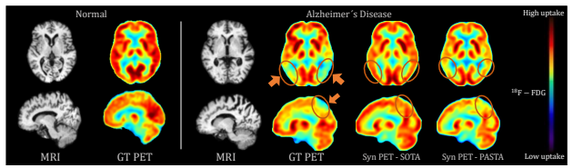
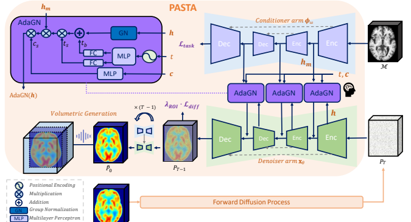
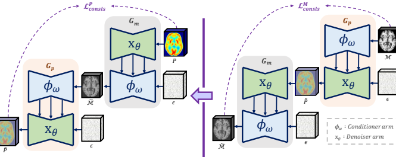
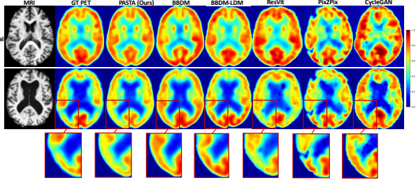
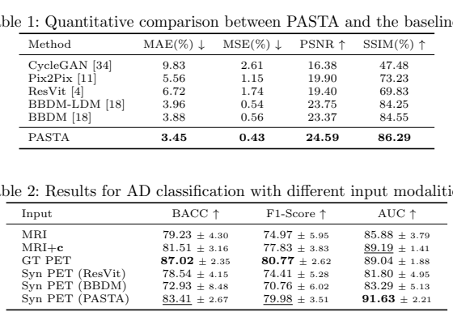
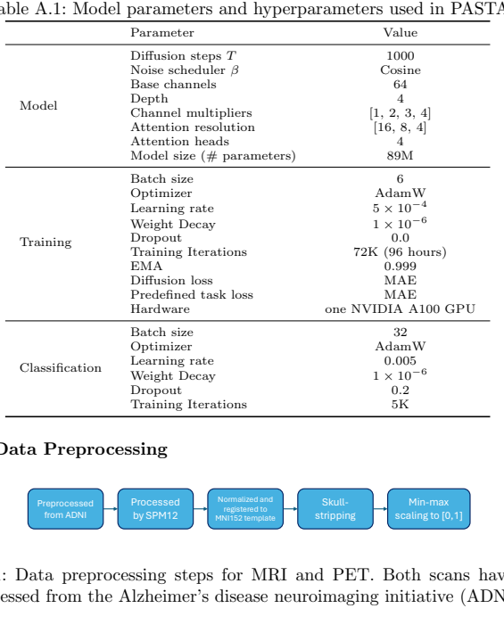

# PASTA: Pathology-Aware MRI to PET CroSs-modal TrAnslation with Diffusion Models

Paper: [PASTA: Pathology-Aware MRI to PET CroSs-modal TrAnslation with Diffusion Models](https://arxiv.org/html/2405.16942v1)  
PDF: [pasta_2405.16942.pdf](pasta_2405.16942.pdf)  
Code: https://github.com/ai-med/PASTA  
Authors: Yitong Li, Igor Yakushev, Dennis M. Hedderich, Christian Wachinger

## 0. The Goal

The goal of this paper is to synthesize **FDG-PET** from **T1-weighted MRI** for Alzheimer's disease (AD) assessment.

The motivation is clinical:

```text
MRI:
    accessible, non-invasive, no radiation
    shows structural atrophy

FDG-PET:
    expensive, radiation exposure, less widely available
    shows glucose metabolism and functional abnormality
```

For AD, PET is especially useful because it captures **hypometabolism** in disease-relevant regions, such as the temporoparietal lobes. MRI can show atrophy, but PET is often more sensitive to functional change.

So the translation problem is:

```text
input:  structural MRI
output: synthetic functional PET
```

The core requirement is not only image realism. The generated PET must preserve **pathology evidence**, otherwise it may be visually plausible but clinically misleading.



Fig. 1 is the main motivation. Existing diffusion translation methods can recover global PET-like structure, but may miss the AD-related hypometabolism pattern. PASTA is designed to preserve this pathology.

## 1. One-Sentence Summary

PASTA is a conditional diffusion framework for MRI-to-PET translation that improves pathology preservation through:

- a symmetric **dual-arm architecture**
- **adaptive group normalization** for multi-modal condition fusion
- **clinical and pathology priors**
- **cycle exchange consistency**
- a memory-efficient **2.5D volumetric generation** strategy

In short:

```text
PASTA does not just translate MRI style into PET style.
It tries to synthesize PET that preserves clinically relevant AD pathology.
```

## 2. Why MRI-to-PET Translation Is Hard

General image-to-image translation often focuses on:

```text
source image structure
+ target modality appearance
```

For medical translation, this is not enough. A synthetic PET scan can look realistic but still be clinically wrong if it misses or invents hypometabolism.

This creates a harder objective:

```text
synthetic PET should:
    match the ground-truth PET structurally
    match the ground-truth PET pathologically
    remain useful for downstream AD diagnosis
```

The paper argues that existing diffusion-based translation methods mostly preserve structure, but under-emphasize pathology recovery.

## 3. Overall Architecture



PASTA has two symmetric U-Net arms:

```text
Conditioner arm:
    MRI -> multi-scale task-specific representations h_m

Denoiser arm:
    noisy PET -> clean PET
    conditioned on h_m, diffusion timestep, clinical data, and pathology priors
```

The important design choice is **strong interaction** between the MRI input and the PET denoising process. Instead of using MRI as a weak global condition, PASTA injects MRI-derived features into the denoiser at multiple scales.

Because both arms are U-Nets with symmetric resolutions, a feature map from the conditioner arm can condition the matching-resolution block in the denoiser arm.

Conceptually:

```text
MRI feature at coarse scale
    -> conditions PET denoising at coarse scale

MRI feature at fine scale
    -> conditions PET denoising at fine scale
```

This is meant to preserve both global brain structure and local pathology patterns.

## 4. Conditioner Arm

The training data are paired MRI/PET volumes:

$$
D_T = \{(M^i, P^i)\}_{i=1}^{N}
$$

where:

- $M$ is MRI
- $P$ is PET

The conditioner arm processes MRI and produces multi-scale representations:

```text
MRI M
-> conditioner arm
-> h_m = {h_m^1, ..., h_m^n}
```

These intermediate representations are used by the PET denoiser.

The conditioner arm is trained with a predefined task. The paper tests alternatives, but finds that **MRI-to-PET translation as the predefined task** works best.

Its task loss is conceptually:

$$
L_{task} = E_{M,P} \; dist(\phi_{\omega}(M), P)
$$

where $dist(\cdot)$ can be $L_1$ or $L_2$.

Intuition:

```text
The conditioner arm should not produce generic MRI features.
It should produce MRI features already biased toward PET synthesis.
```

## 5. Adaptive Conditional Module

PASTA uses **Adaptive Group Normalization (AdaGN)** to inject conditions into the denoiser.

The denoiser receives three types of condition:

1. **Diffusion timestep**
   - tells the model how noisy the current PET sample is

2. **Task-specific MRI representations**
   - multi-scale features $h_m$ from the conditioner arm

3. **Clinical data**
   - demographic information: age, gender, education
   - cognitive scores: MMSE, ADAS-Cog-13
   - genetic biomarker: ApoE4

Conceptually, AdaGN modulates a denoiser feature map using scale and bias terms derived from these conditions:

```text
denoiser feature h
+ timestep embedding
+ MRI feature h_m
+ clinical vector c
-> conditioned denoiser feature
```

This is important because AD pathology is not only visible in anatomy. Clinical variables can provide disease-stage and risk information that helps guide PET synthesis.

## 6. Denoiser Arm and Pathology Priors

The denoiser arm performs the reverse diffusion process:

```text
Gaussian noise
-> denoising steps
-> synthetic PET
```

It is conditioned by:

- MRI representations from the conditioner arm
- clinical data
- diffusion timestep
- pathology priors

### MetaROI Prior

To increase pathology awareness, PASTA uses **MetaROIs** as anatomical priors.

MetaROIs are pre-defined regions frequently reported in PET studies comparing AD and normal subjects. They correspond to regions where AD-related hypometabolism is expected to appear.

PASTA converts MetaROIs into a loss weighting map:

```text
errors inside AD-relevant regions
-> penalized more strongly
```

This pushes the model to pay more attention to clinically important hypometabolic regions rather than optimizing only global reconstruction quality.

Conceptually:

```text
not all PET pixels are equally important for AD diagnosis
```

## 7. Cycle Exchange Consistency



CycleEx is one of the most interesting ideas in the paper.

Standard cycle consistency says:

```text
MRI -> PET -> MRI should reconstruct MRI
PET -> MRI -> PET should reconstruct PET
```

PASTA adapts this idea to its symmetric dual-arm architecture. The trick is that the two mappings share the same components, but exchange the roles of conditioner and denoiser arms.

Forward cycle:

```text
MRI
-> synthesize PET
-> reconstruct MRI
```

Backward cycle:

```text
PET
-> synthesize MRI
-> reconstruct PET
```

The cycle loss is:

$$
L_{cycle}
=
E_M \; dist(G_m(G_p(M)), M)
+
E_P \; dist(G_p(G_m(P)), P)
$$

The final training objective combines:

$$
L
=
\lambda_{task} L_{task}
+
\lambda_{diff} L_{diff}
+
\lambda_{cycle} L_{cycle}
$$

The key point:

```text
CycleEx adds supervision and regularization
without adding extra learnable parameters.
```

It encourages information sharing between the two arms and improves generation quality in the ablation study.

## 8. Volumetric Generation

Medical scans are 3D volumes, but full 3D diffusion is expensive.

PASTA uses a **2.5D strategy**:

```text
input:
    one target slice
    + neighboring slices along the same axis

network:
    2D convolutional model

output:
    target slice and neighbors
```

During inference, each slice is generated multiple times as a neighbor of different target slices. The final 3D volume is obtained by weighted averaging:

```text
closer generated slices get higher weight
overlapping predictions are averaged
```

This gives some inter-slice consistency without the full memory cost of 3D convolutional diffusion.

## 9. Experiments

Dataset:

```text
ADNI paired T1 MRI and FDG-PET
N = 1,248 paired scans

CN:  379
MCI: 611
AD:  257
```

Both modalities are co-registered to:

```text
96 x 112 x 96
```

Baselines:

- Pix2Pix
- CycleGAN
- ResVit
- BBDM
- BBDM-LDM

Evaluation:

- MAE
- MSE
- PSNR
- SSIM
- qualitative clinical assessment
- downstream AD classification using synthesized PET

## 10. Qualitative Results



Fig. 4 compares MRI, real PET, and synthesized PET from different methods.

The key observation:

```text
PASTA preserves the AD hypometabolism pattern better than the baselines.
```

GAN-based methods such as Pix2Pix and CycleGAN show obvious artifacts. BBDM and BBDM-LDM preserve PET-like structure, but do not transfer pathology reliably. ResVit improves pathology awareness, but gives less accurate anatomy.

PASTA is smoother than real PET, but the authors argue this is not necessarily a clinical drawback because PET images are often filtered and AD diagnosis does not require high-resolution edge detail.

## 11. Quantitative and Classification Results



### 11.1 Image Similarity Metrics

PASTA achieves the best reconstruction metrics:

```text
MAE:   3.45
MSE:   0.43
PSNR: 24.59
SSIM: 86.29
```

BBDM is the strongest baseline among prior methods, but PASTA still improves across all metrics.

This supports the claim that diffusion models are promising for MRI-to-PET translation, but that architecture and conditioning matter.

### 11.2 AD Classification

The authors also test whether synthesized PET is useful for AD diagnosis.

They train 3D ResNet classifiers on:

- MRI
- MRI + clinical data
- real PET
- synthetic PET from ResVit
- synthetic PET from BBDM
- synthetic PET from PASTA

Key result:

```text
MRI BACC:             79.23
MRI + clinical BACC:  81.51
GT PET BACC:          87.02
Syn PET (PASTA):      83.41
```

PASTA improves over MRI by more than 4 percentage points in balanced accuracy and nearly reaches real PET in F1 score.

It also achieves the highest AUC:

```text
GT PET AUC:       89.04
Syn PET PASTA:    91.63
```

The paper interprets this as evidence that PASTA preserves clinically relevant pathology better than the baselines.

## 12. Ablations

The paper ablates:

- CycleEx
- pathology priors / MetaROI
- clinical data
- predefined conditioner task
- loss weights
- condition integration strategies

Main table:

```text
w/o CycleEx:       MAE 3.99, SSIM 85.14
w/o pathology prior: MAE 3.67, SSIM 85.95
w/o clinical data:   MAE 3.57, SSIM 86.12
PASTA full:        MAE 3.45, SSIM 86.29
```

CycleEx has the largest impact among the listed ablations. This suggests that the cyclic exchange regularization is central to PASTA's image quality.

The predefined conditioner task also matters:

```text
MRI reconstruction task (M2M) is worse than MRI-to-PET task.
```

This supports the earlier intuition: the conditioner arm should learn features specifically useful for PET synthesis, not generic MRI reconstruction.

## 13. Implementation Notes



Important hyperparameters from the supplementary material:

```text
diffusion steps: 1000
noise scheduler: cosine
base channels: 64
depth: 4
attention resolutions: [16, 8, 4]
model size: 89M parameters
batch size: 6
optimizer: AdamW
training iterations: 72K
hardware: one NVIDIA A100 GPU
```

Preprocessing:

```text
ADNI preprocessed scans
-> SPM12 processing
-> normalize/register to MNI152 template
-> skull stripping
-> min-max scaling to [0, 1]
```

## 14. Understanding

The central problem is not simply:

```text
Can we make MRI look like PET?
```

The real clinical problem is:

```text
Can we infer PET-like functional pathology from MRI and clinical evidence
without hallucinating or erasing disease-specific patterns?
```

PASTA's design answers this with three layers of pathology awareness:

1. **Multi-scale MRI conditioning**
   - the denoiser sees MRI-derived features at corresponding resolutions

2. **Clinical and pathology priors**
   - clinical variables and MetaROIs bias the model toward AD-relevant information

3. **CycleEx regularization**
   - the two arms must share enough information to reconstruct across both directions

The paper's strongest point is that it does not rely only on pixel similarity metrics. It evaluates whether synthetic PET improves AD classification. That is important because in medical translation, the clinically relevant signal may be small and localized.

## 15. Relation to Medical Image Translation

PASTA is a useful example of why medical image translation differs from natural image translation.

In natural images, style transfer failure may be visually obvious. In medical images, a generated image can look realistic but be diagnostically wrong.

So the relevant question becomes:

```text
Does the generated modality preserve downstream clinical evidence?
```

For MRI-to-PET translation, that means preserving hypometabolism patterns, especially in AD-relevant regions.

This paper also illustrates a general recipe:

```text
conditional diffusion
+ multi-scale source-modality features
+ clinical metadata
+ pathology-aware loss weighting
+ downstream clinical validation
```

That recipe is likely useful beyond MRI-to-PET, for example:

- low-dose to full-dose PET
- MRI contrast translation
- CT-to-MRI synthesis
- missing modality imputation
- cross-modal disease biomarker estimation

## 16. Key Takeaways

- PASTA translates MRI to synthetic PET with conditional diffusion.
- The main goal is pathology-aware translation, not just realistic PET appearance.
- The model uses a symmetric conditioner/denoiser dual-arm architecture.
- AdaGN fuses diffusion timestep, MRI features, and clinical data.
- MetaROI weighting focuses the diffusion loss on AD-relevant hypometabolic regions.
- CycleEx improves supervision and regularization without adding new learnable parameters.
- A 2.5D volumetric generation strategy improves 3D consistency efficiently.
- PASTA achieves the best MAE/MSE/PSNR/SSIM among baselines.
- Synthetic PET from PASTA improves AD classification over MRI and approaches real PET performance.
