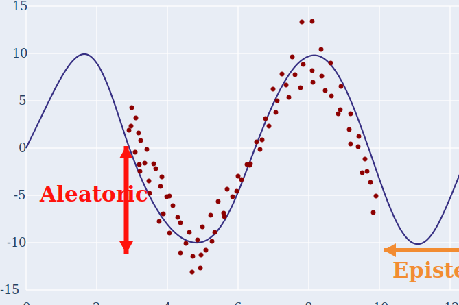

# Aleatoric vs. Epistemic Uncertainty

## Big picture

Uncertainty in ML predictions is often split into two parts:

| Type | Intuition | Comes from | Can more data reduce it? | Example |
|---|---|---|---|---|
| **Aleatoric uncertainty** | Data/noise uncertainty | Randomness or ambiguity inherent in the observation process | Usually **no**, unless measurement quality improves | blurry boundary, sensor noise, label ambiguity |
| **Epistemic uncertainty** | Model/knowledge uncertainty | The model has not seen enough relevant data | Usually **yes** | extrapolating outside the training distribution |



In the plot:

- The vertical spread of red points around the true curve is **aleatoric uncertainty**.
  Even if the model knows the correct underlying function, the observed `y` values are noisy.
- The region on the right with no red training points is **epistemic uncertainty**.
  The model is extrapolating because it has little or no data there.

One sentence version:

> **Aleatoric = the world is noisy. Epistemic = the model does not know enough.**

## Aleatoric uncertainty

Aleatoric uncertainty is uncertainty that remains even with infinite data, because the target itself is noisy or ambiguous.

For supervised learning, instead of assuming:

$$
y = f(x)
$$

we assume:

$$
y = f(x) + \epsilon
$$

where $\epsilon$ is observation noise.

There are two common cases:

1. **Homoscedastic aleatoric uncertainty**
   - Noise level is constant across all inputs.
   - Example: every measurement has roughly the same sensor noise.

2. **Heteroscedastic aleatoric uncertainty**
   - Noise level depends on the input $x$.
   - Example: image segmentation boundaries may be uncertain only in blurry or low-contrast regions.

In modern uncertainty modeling, heteroscedastic uncertainty is often more useful because the model predicts both:

$$
\mu(x)
$$

and

$$
\sigma^2(x)
$$

where:

- $\mu(x)$ is the predicted mean.
- $\sigma^2(x)$ is the predicted data noise / aleatoric uncertainty.

## Quantifying aleatoric uncertainty with negative log-likelihood

Your memory is basically right, with one important wording correction:

> We usually use **negative log-likelihood**, or **NLL**, not "negative likelihood".

For regression, a common assumption is:

$$
y \mid x \sim \mathcal{N}(\mu(x), \sigma^2(x))
$$

The Gaussian negative log-likelihood is:

$$
\mathcal{L}_{NLL}
=
\frac{1}{2}\log\sigma^2(x)
+
\frac{(y - \mu(x))^2}{2\sigma^2(x)}
+
\text{constant}
$$

This loss has two competing terms:

- $\frac{(y - \mu(x))^2}{2\sigma^2(x)}$
  - If prediction error is large, the model can reduce penalty by predicting larger variance.
- $\frac{1}{2}\log\sigma^2(x)$
  - Prevents the model from making variance infinitely large.

So NLL lets the model learn a calibrated uncertainty estimate:

$$
\text{Aleatoric uncertainty} \approx \sigma^2(x)
$$

Important distinction:

> **NLL is the training objective / scoring rule. The predicted variance $\sigma^2(x)$ is the actual aleatoric uncertainty estimate.**

Practical interpretation:

```text
Model output:
    mu(x)        = predicted mean
    sigma^2(x)   = predicted variance

Training loss:
    NLL(mu(x), sigma^2(x), y)

After training:
    sigma^2(x) is used as the aleatoric uncertainty estimate
```

So the short answer is:

> **Negative log-likelihood is not the uncertainty itself. It is the loss used to train the model to predict variance. The predicted variance is the aleatoric uncertainty.**

In practice, models often predict:

$$
s(x) = \log\sigma^2(x)
$$

instead of $\sigma^2(x)$ directly, because log variance is numerically more stable and guarantees positive variance after exponentiation:

$$
\sigma^2(x) = \exp(s(x))
$$

Then the NLL becomes:

$$
\mathcal{L}_{NLL}
=
\frac{1}{2}s(x)
+
\frac{1}{2}\exp(-s(x))(y - \mu(x))^2
$$

## Epistemic uncertainty

Epistemic uncertainty comes from lack of knowledge about the correct model or parameters.

Instead of saying "the data itself is noisy", epistemic uncertainty says:

> The model is unsure because the training data did not constrain this region well.

This is high when:

- The input is far from the training distribution.
- There are few training examples in that region.
- Several different models explain the training data equally well but disagree on this input.

Common ways to estimate epistemic uncertainty:

- **Bayesian neural networks**
  - Learn a distribution over weights $p(w \mid D)$.
- **MC dropout**
  - Keep dropout active at test time and sample multiple predictions.
- **Deep ensembles**
  - Train multiple models with different initializations and compare their predictions.

For a model ensemble, if each model predicts $\hat{y}_m(x)$, epistemic uncertainty can be approximated by disagreement:

$$
\text{Epistemic uncertainty}
\approx
\text{Var}_{m}[\hat{y}_m(x)]
$$

If all models agree but each predicts high noise, that suggests aleatoric uncertainty.
If models disagree strongly, that suggests epistemic uncertainty.

## Total predictive uncertainty

A useful mental model:

$$
\text{Total uncertainty}
=
\text{Aleatoric uncertainty}
+
\text{Epistemic uncertainty}
$$

For regression with Bayesian/ensemble models:

$$
\underbrace{\text{Var}(y \mid x, D)}_{\text{total predictive uncertainty}}
=
\underbrace{\mathbb{E}_{w}[\sigma_w^2(x)]}_{\text{aleatoric}}
+
\underbrace{\text{Var}_{w}[\mu_w(x)]}_{\text{epistemic}}
$$

where:

- $\mathbb{E}_{w}[\sigma_w^2(x)]$ is the average predicted data noise.
- $\text{Var}_{w}[\mu_w(x)]$ is disagreement between possible models.

This decomposition is especially clean for ensembles or Bayesian models where each sampled model predicts both a mean and a variance.

## Classification version

For classification, the model predicts a distribution:

$$
p(y \mid x)
$$

The usual NLL is cross-entropy:

$$
\mathcal{L}_{NLL} = -\log p(y_{\text{true}} \mid x)
$$

Uncertainty can be measured using entropy:

$$
H[p(y \mid x)] = -\sum_c p(y=c \mid x)\log p(y=c \mid x)
$$

With Bayesian models or ensembles, classification uncertainty can be decomposed as:

$$
\underbrace{H[p(y \mid x, D)]}_{\text{total uncertainty}}
=
\underbrace{\mathbb{E}_{w}[H[p(y \mid x, w)]]}_{\text{aleatoric}}
+
\underbrace{I(y, w \mid x, D)}_{\text{epistemic}}
$$

Interpretation:

- **Aleatoric**: each individual model is uncertain because the input is intrinsically ambiguous.
- **Epistemic**: different models disagree because the training data did not determine the answer.

## Quick diagnostic

| Situation | Likely uncertainty type |
|---|---|
| Many models agree, but prediction distribution is broad | Aleatoric |
| Many models disagree with each other | Epistemic |
| More data from the same region helps | Epistemic |
| Better sensor / cleaner labels help | Aleatoric |
| Out-of-distribution input | Usually epistemic |
| Ambiguous label even for humans | Usually aleatoric |

## Key takeaway

Aleatoric uncertainty is about **noise in the data-generating process**. It is often modeled by predicting an input-dependent variance $\sigma^2(x)$ and trained using **negative log-likelihood**.

Epistemic uncertainty is about **lack of model knowledge**. It is often estimated by Bayesian methods, MC dropout, or ensembles, and shows up as disagreement between plausible models.
